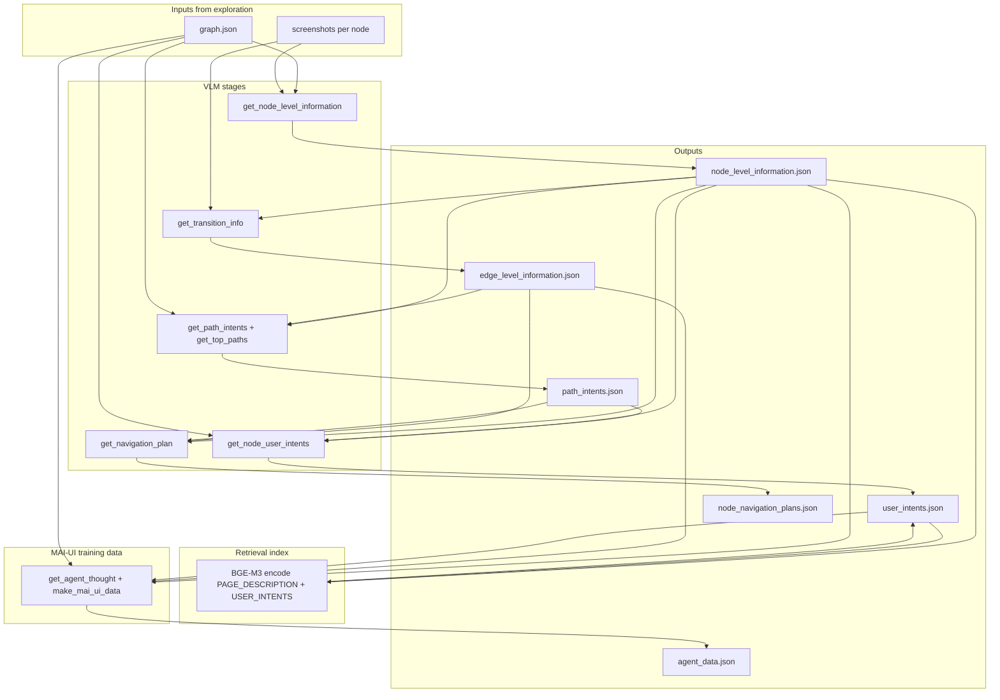
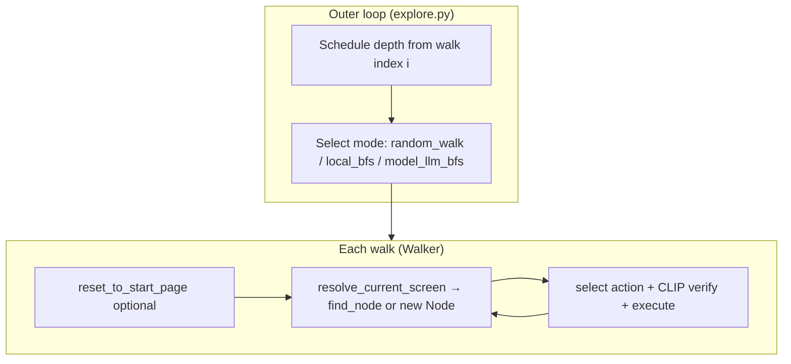

# Exploration stack

Automated mobile app exploration: vision-language **agents** act on a device, a **VLM** backend (`VLM` or `VLM_Yibu`) extracts screens and elements, and a **navigation graph** grows over many walks. Run everything from `refactored/exploration/` so imports resolve.

**The pipeline has two phases:**

1. **Exploration** (`explore.py`) — grow `graph.json`, per-node screenshots, and `app_graph.pkl` under `logs.root`.
2. **Post-processing** (`post_process.py`) — read that graph and produce structured artifacts: **node-level page descriptions**, **edge transition hints**, **ranked path intents**, **user intents**, **navigation plans**, **BGE-M3 embeddings**, and **MAI-UI training samples** (`user_intents.json`, `node_navigation_plans.json`, `agent_data.json`, and intermediate JSON files under the same `logs.root`).

You need a completed exploration run (same `logs.root` as in your YAML) before post-processing. Post-processing does not drive the device.

---

## How to run

Follow these steps before a long run. Skipping device checks is the most common cause of bad graphs (wrong start screen, walks stopping on launcher/browser, or exploring outside the target app).

> **Critical:** Every `random_walk`, BFS approach, and agent backtrack starts from **`driver.reset_to_start_page()`** (5× back → **force-stop** app → relaunch → **scroll to top** (unless `skip_scroll_up_on_reset`) → optional agent steps). If reset does not open the **correct app** and land on a **stable start screen**, exploration will graph the wrong UI or stop immediately. **Always verify `reset_to_start_page()` end-to-end on the device** before a long `exploration_walks` run.

> **Highly recommended:** After editing your YAML (especially `driver.appPackage`, `driver.appActivity`, `driver.use_launcher_intent`, and `driver.reset_instruction`), run **`check_driver.py`** on the physical device **before** `explore.py`. It interactively checks launch, reset, and foreground detection — see [Driver preflight (`check_driver.py`)](#driver-preflight-check_driverpy).

### 1) Verify the driver — especially `reset_to_start_page()`

| Setting | YAML keys | What you must get right |
|---------|-----------|-------------------------|
| **App identity** | `driver.appPackage`, `driver.appActivity` | `appPackage` must match the installed app. **Android:** `appActivity` is the launcher activity (see [resolve activity](#resolve-apppackage-and-appactivity-android)). **Harmony:** `appActivity` is the **entry ability** / `mainElementName` from `bm dump` (see [resolve entry ability](#resolve-apppackage-and-appactivity-harmony)). |
| **Launcher launch** | `driver.use_launcher_intent` or `$` in `appActivity` | **Android only.** Some apps break `am start -n pkg/activity`: YouTube (`$` stripped by shell), Outlook (foreground activity ≠ launchable component — e.g. `CentralActivity` from `topResumedActivity` fails but MAIN/LAUNCHER works). Set **`use_launcher_intent: true`** in YAML when component launch fails. Auto-enabled when `appActivity` contains `$`. |
| **Force-close + relaunch** | `close_application()` (in reset) | **`am force-stop` / `aa force-stop`** on `appPackage` kills the process (avoids YouTube-style “minimized in Recents” after Back only). Then `run_application()` cold-starts the app. **Always verify both methods on the device** before a long run (see checklist below). |
| **Scroll to top** | `driver.skip_scroll_up_on_reset` (default off) | After relaunch, one centered **scroll up** swipe (~35% screen height) so feeds/lists start near the top. Set **`skip_scroll_up_on_reset: true`** when the start screen is not scrollable (todo list, tab bar) and scroll-up would move away from the anchor. |
| **Reset instruction** | `driver.reset_instruction` | **Required for reliable exploration.** Natural-language goal for the agent loop **after** force-stop, launch, and optional scroll-up. The agent must reach your canonical tab/screen and return **`finished`**. Without this, reset only relaunches the app and may leave you on the wrong tab, splash, or a dialog. |
| **Foreground detection** | `get_foreground_package()` | When `driver.skip_exploration_for_no_app_package: true`, Walker stops the walk if foreground ≠ `appPackage`. **Test on several in-app screens** (tabs, settings, sheets) — not only right after reset. Implemented on **Android** (`dumpsys window`) and **Harmony** (`uitest dumpLayout` bundle grep). |

#### Resolve `appPackage` and `appActivity` (Android)

```bash
adb -s YOUR_DEVICE_ID shell cmd package resolve-activity --brief YOUR.PACKAGE | tail -1
# Example: com.google.android.youtube/.app.honeycomb.Shell$HomeActivity
```

Put **`appPackage`** = package name. Put **`appActivity`** = part after `/` (e.g. `.app.honeycomb.Shell$HomeActivity` or full class). **`appActivity` from `topResumedActivity` is not always launchable** — if `am start -n pkg/activity` fails (Error type 3 / activity not found) but MAIN/LAUNCHER works, set **`use_launcher_intent: true`** in YAML (see `configs/outlook_android.yaml`, `configs/youtube_android.yaml`, and [AndroidDriver `run_application()`](#androiddriver)).

Test launch:

```bash
# Component (works when activity has no $ stripped by adb shell)
adb -s YOUR_DEVICE_ID shell am start -W -n YOUR.PACKAGE/YOUR.ACTIVITY

# Launcher intent (works for YouTube and other inner-class $ names)
adb -s YOUR_DEVICE_ID shell am start -a android.intent.action.MAIN -c android.intent.category.LAUNCHER -p YOUR.PACKAGE
```

#### Resolve `appPackage` and `appActivity` (Harmony)

Harmony uses **bundle name** + **entry ability** (`mainElementName`). Put the ability name in YAML as `driver.appActivity`.

Get the entry ability for a package:

```bash
hdc -t {device_id} shell "bm dump -n APP_PACKAGE_NAME | grep '\"mainElementName\"' | sed -E 's/.*\"mainElementName\": \"([^\"]+)\".*/\1/'"
# Example:
hdc -t YOUR_DEVICE_ID shell "bm dump -n com.huawei.hmos.clock | grep '\"mainElementName\"' | sed -E 's/.*\"mainElementName\": \"([^\"]+)\".*/\1/'"
```

Or call `driver.get_app_version()` after `build_driver()` — the returned `entry.ability_name` / `entry.launch_command` fields echo the parsed `mainElementName` and a suggested `aa start` command from `bm dump -n`.

Test launch:

```bash
hdc -t YOUR_DEVICE_ID shell aa start -a YOUR_ABILITY -b YOUR.PACKAGE
# Example:
hdc -t YOUR_DEVICE_ID shell aa start -a com.huawei.hmos.clock.phone -b com.huawei.hmos.clock
```

Test force-stop (same as `close_application()`):

```bash
hdc -t YOUR_DEVICE_ID shell aa force-stop YOUR.PACKAGE
```

#### Driver preflight (`check_driver.py`)

**Run this before `explore.py`** whenever you add a new app config or change driver settings.

From `refactored/exploration/`:

```bash
python check_driver.py --config configs/your_app.yaml
```

Interactive steps:

| Step | What it tests |
|------|----------------|
| 1 | `run_application()` — cold launch |
| 2 | `reset_to_start_page()` — force-stop, relaunch, scroll-up, agent `reset_instruction` (verbose MAI-UI debug via `Debugger`) |
| 3 | Loop — you navigate on device; script prints `get_foreground_package()` vs `appPackage` |

**Before step 1**, confirm launch in your YAML:

1. Test component launch: `adb shell am start -W PACKAGE/ACTIVITY`
2. If that fails, test launcher: `adb shell am start -a android.intent.action.MAIN -c android.intent.category.LAUNCHER -p PACKAGE`
3. If only launcher works, add **`use_launcher_intent: true`** under `driver:` in your config (required for Outlook and YouTube-style apps).

Also set a working **`reset_instruction`** before step 2 — the agent must reach your exploration anchor screen and terminate with success.

#### Preflight: `reset_to_start_page()` must work on the device

Watch the phone while you run `check_driver.py` (or the snippet below):

```python
# From refactored/exploration/ — prefer check_driver.py for interactive checks
from dynaconf import Dynaconf
from Agents.factory import build_agent
from Driver.factory import build_driver

configs = Dynaconf(settings_files=["configs/your_app.yaml"], merge_enabled=True).default
agent = build_agent(model_name=configs.agent.model_name, url=configs.agent.url, agent_settings=configs.agent.settings)
driver = build_driver(settings=configs.driver, agent=agent)

driver.reset_to_start_page()   # back ×5 → force-stop → launch → scroll up (unless skip_scroll_up_on_reset) → agent until finished
driver.close_application()
driver.run_application()
assert driver.get_foreground_package() == configs.driver.appPackage
# Screenshot should show your reset_instruction target (e.g. Alarm tab, YouTube Home)
print(driver.get_app_version())  # Harmony: includes entry.ability_name / entry.launch_command
```

Manual force-stop + launch (same as `close_application` + `run_application`):

```bash
# Android
adb -s YOUR_DEVICE_ID shell am force-stop YOUR.PACKAGE
adb -s YOUR_DEVICE_ID shell am start -a android.intent.action.MAIN -c android.intent.category.LAUNCHER -p YOUR.PACKAGE

# Harmony
hdc -t YOUR_DEVICE_ID shell aa force-stop YOUR.PACKAGE
hdc -t YOUR_DEVICE_ID shell aa start -a YOUR_ABILITY -b YOUR.PACKAGE
```

**Checklist before a long run:**

0. **`check_driver.py --config configs/your_app.yaml`** — launch, reset, and foreground checks pass; **`use_launcher_intent: true`** set when component `am start -n` fails on device.
1. **`reset_to_start_page()`** fully kills and relaunches the app (not left in Recents), scrolls toward the top, then leaves the app on the intended start screen (agent returned `finished` if `reset_instruction` is set).
2. **`close_application()`** then **`run_application()`** — watch the device: the app must **fully exit** after force-stop and **cold-start** into the target app (not stay in Recents / wrong ability).
3. **`get_foreground_package()`** == `appPackage` on the start screen and on **2–3 other in-app pages** you care about (tabs, settings, sheets). If this fails on Harmony, fix `appActivity` (entry ability) or the `uitest dumpLayout` grep path before enabling `skip_exploration_for_no_app_package`.
4. **Startup logs** use `logs.root` from **this** YAML — confirm `explore.py --config` / `CONFIG` points at the right file (see step 3).
5. **`driver.device_id`** matches `adb devices` (Android) or `hdc list targets` (Harmony); **`agent.url`** is healthy.

Optional connectivity / foreground checks:

```bash
# Android
adb -s YOUR_DEVICE_ID shell echo ok
adb -s YOUR_DEVICE_ID shell dumpsys window | grep -E 'mCurrentFocus|mFocusedApp|topResumedActivity'

# Harmony
hdc -t YOUR_DEVICE_ID shell echo ok
hdc list targets
# Foreground bundle (same idea as get_foreground_package)
hdc -t YOUR_DEVICE_ID shell "uitest dumpLayout -p /data/local/tmp/window_dump.json >/dev/null && cat /data/local/tmp/window_dump.json | grep -oE '\"bundleName\":\"[^\"]+\"|\"bundleName\": \"[^\"]+\"' | sed -E 's/.*\"bundleName\"[ ]*:[ ]*\"([^\"]+)\".*/\1/' | grep -vE 'com\.ohos\.sceneboard|com\.ohos\.systemui|com\.ohos\.launcher' | head -n 1"
```

### 2) Create a config file

Copy `configs/clock_android.yaml` or `configs/amazon_android.yaml` to a new YAML under `configs/`. Dynaconf loads the top-level `default:` block; `explore.py` passes `--config` to that file.

```yaml
default:
  app:
    name: "MyApp"
    description: "Short description for VLM prompts"

  driver:          # device + launch + reset
  vlm:             # API keys, use_yibu_api, model names for extraction & summary
  screenshots:     # crop / JPEG settings for CLIP and dumps
  agent:           # on-device navigation agent (MAI-UI / UI-TARS server URL)
  graph:           # exploration schedule, modes, matcher thresholds, backtrack
  logs:            # output directory + resume flag
  post_process:    # VLM settings for post_process.py (after exploration)
```

| Section | Important keys | Purpose |
|---------|----------------|---------|
| **`driver`** | `device_id`, `os_name`, `appPackage`, `appActivity` | Device connection and launch (**Android:** `use_launcher_intent`; **Harmony:** entry ability from `bm dump`) |
| | `reset_instruction` | **Strongly recommended** — agent loop inside `reset_to_start_page()` (see step 1) |
| | `skip_scroll_up_on_reset` | Skip scroll-up after relaunch when the anchor screen is not scrollable (e.g. todo list, tab bar) |
| | `use_launcher_intent` | `true` → `am start` with MAIN/LAUNCHER + `appPackage` (for `$` in activity, e.g. YouTube) |
| | `skip_exploration_for_no_app_package` | Stop walk when foreground leaves `appPackage` |
| **`agent`** | `url`, `model_name`, `settings.history_n`, `settings.resize_factor` | Path-following agent for reset and agent backtrack |
| **`vlm`** | `use_yibu_api`, `yibu_api_key`, `alibaba_api_key`, model names, image size/quality | Screen understanding — see [VLM backends](#vlm-backends-dashscope-and-yibu) |
| **`graph`** | `exploration_walks` | Total outer-loop walks |
| | `exploration_schedule_depth_iterations` | Maps walk index → max actions per walk (e.g. `{1: 20, 2: 100, 3: 200}`) |
| | `exploration_modes.probabilities` | Weights: `random_walk`, `local_bfs`, `model_llm_bfs` |
| | `exploration_modes.local_bfs.max_branching_factor` | Branches per BFS anchor |
| | `exploration_modes.local_bfs.backtracking_*` | CLIP/XML gates for VLM undo vs agent replay |
| | `exploration_modes.model_llm_bfs.*` | LLM node ranking for `llm_based_bfs` |
| | `global_localization.find_node_*` | Four-stage screen matcher thresholds |
| | `action_matching_clip_similarity_threshold` | Live CLIP verify before tap |
| **`logs`** | `root` | All outputs (graph, screenshots, `explore.log`) — **gitignored** as `explored_apps/` |
| | `resume_from_checkpoint` | Load `app_graph.pkl` from `logs.root` if present |
| **`post_process`** | `use_yibu_api`, per-stage `vlm_model_name_for_*`, image size/quality for node/edge VLM calls, `max_workers` | VLM settings for `post_process.py` — see [Post-processing](#post-processing-post_processpy) |

Full key reference: [Graph exploration → config tables](#graph-exploration), [Post-processing config](#post-processing-config-post_process-in-yaml).

**Launcher intent:** When creating a new config, test `am start -n` vs MAIN/LAUNCHER on the device (see [Driver preflight](#driver-preflight-check_driverpy)). If only launcher works, add `use_launcher_intent: true` under `driver:` before running `check_driver.py`.

### 3) Run exploration (colored logs)

**Prerequisite:** [Driver preflight (`check_driver.py`)](#driver-preflight-check_driverpy) should pass on the device for this config.

From `refactored/exploration/`. **`CONFIG` must be set** — `run_explore.sh` uses the `CONFIG` environment variable (no default app).

```bash
export FORCE_COLOR=1
export MPLBACKEND=Agg   # optional; avoids matplotlib/Tk warnings from num_nodes_vs_walk.png

CONFIG=configs/clock_android.yaml ./run_explore.sh
# or
CONFIG=./configs/youtube_android.yaml ./run_explore.sh
```

`run_explore.sh` reads `logs.root` from that config, creates the folder, and runs:

```bash
python -u explore.py --config "$CONFIG" 2>&1 | tee "$ROOT/explore.log"
```

**Colored terminal output:** piping through `tee` is not a TTY, so Rich/`Debugger` disables colors unless you set **`FORCE_COLOR=1`** in the shell first (once per session). Running `python -u explore.py --config ...` directly without `tee` usually keeps colors without this.

Direct Python (no log file) — use the same config path as in step 1 preflight:

```bash
python -u explore.py --config configs/youtube_android.yaml
```

Confirm startup logs: **`package`** in App Meta info matches `driver.appPackage`, and checkpoint path matches **`logs.root`** (e.g. `explored_apps/youtube/`, not `explored_apps/clock/`).

Artifacts land under **`logs.root`**: `app_graph.pkl`, `graph.json`, `screenshots/`, `interactive_node_graph.html`, `num_nodes_vs_walk.png`, `explore.log`.

### 4) Run post-processing (`post_process.py`)

After exploration finishes (or you have a usable checkpoint under the same `logs.root`), run post-processing to build navigation metadata.

**Prerequisites:**

| Artifact | Path | Required |
|----------|------|----------|
| Exported graph | `{logs.root}/graph.json` | yes |
| Node screenshots | `{logs.root}/screenshots/{node_id}.jpg` | yes (one per node on each path) |
| Config | Same YAML as exploration (`logs.root` must match) | yes |

From `refactored/exploration/`. **`CONFIG` must be set** — same pattern as `run_explore.sh`:

```bash
export FORCE_COLOR=1   # optional; if you pipe through tee

CONFIG=configs/clock_android.yaml ./run_post_process.sh
```

`run_post_process.sh` reads `logs.root` from that config, creates the folder if needed, and runs:

```bash
python -u post_process.py --config "$CONFIG" 2>&1 | tee "$ROOT/post_process.log"
```

Direct Python:

```bash
python -u post_process.py --config configs/clock_android.yaml
```

**Output:** `{logs.root}/user_intents.json` (with embeddings), `{logs.root}/node_navigation_plans.json`, `{logs.root}/agent_data.json`, plus intermediate files (`node_level_information.json`, `edge_level_information.json`, `path_intents.json`) and `{logs.root}/post_process.log` when using the shell wrapper.

Detail: [Post-processing](#post-processing-post_processpy).

---

## Post-processing (`post_process.py`)

Turns an explored **app graph** into page descriptions, transition metadata, path rankings, user intents, navigation plans, embeddings, and MAI-UI training pairs.

`post_process.py` runs **seven VLM stages** plus **one embedding stage** in order. Each stage writes a JSON checkpoint under `logs.root` so you can resume or re-run later stages only (see commented calls in the `__main__` block).

| Stage | Function | Output file | VLM call |
|-------|----------|-------------|----------|
| **1** | `save_node_level_information` | `node_level_information.json` | `get_node_level_information` — multimodal page description per node |
| **2** | `save_edge_level_information` | `edge_level_information.json` | `get_transition_info` — action clusters between adjacent nodes (optional action crops) |
| **3** | `save_path_intents` | `path_intents.json` | `get_path_intents` on each root→node path, then `get_top_paths` keeps up to **3** best paths per node |
| **4** | `save_user_intents` | `user_intents.json` | `get_node_user_intents` — **text-only** natural-language intents for the current screen |
| **5** | `save_navigation_plans` | `node_navigation_plans.json` | `get_navigation_plan` — one hint per hop; collapses parallel `alternative_actions` |
| **6** | `add_node_embeddings_to_user_intents` | `user_intents.json` (in place) | **BGE-M3** locally — one dense vector per node |
| **7** | `save_agent_thoughts` | `agent_data.json` | `get_agent_thought` per path hop + `make_mai_ui_data` — MAI-UI `<thinking>` / `<tool_call>` training pairs |

Uses `configs.post_process.use_yibu_api` to choose `VLM_Yibu` vs `VLM` (independent from `vlm.use_yibu_api` during exploration).

### Pipeline flow



### Stage details

**Stage 1 — Node-level information (`save_node_level_information`)**

- One multimodal VLM call per graph node.
- Input: node screenshot + weak `page_summary` from `graph.json`.
- Output per node: `high_level`, `medium_level`, `low_level` page description (active overlay/modal aware).

**Stage 2 — Edge-level information (`save_edge_level_information`)**

- One VLM call per directed edge pair `(source → target)`; all **parallel** graph edges between the same pair are grouped into a single call.
- Input: source/target page descriptions, edge descriptions, normalized bounding boxes, optional action crops.
- Output: `transition_info` list with `low_level_action_description` and `high_level_action_description` per action cluster.
- Stored under key `source|target` in **`edge_level_information.json`**. Multiple clusters mean the explorer recorded several distinct actions that led from the same source screen to the same target screen (e.g. scroll vs tap a button). These are **alternatives**, not a required action sequence — Stage 5 passes them as `alternative_actions` per hop.

**Stage 3 — Path intents (`save_path_intents`)**

- For each node, enumerate shortest paths from every `is_root: true` node.
- Build an alternating trajectory: `[page, actions, page, actions, …, page]`.
- Score each path with `get_path_intents` → `path_user_goals` + `path_reliability`.
- Keep the top **3** path ids via `get_top_paths`.

**Stage 4 — User intents (`save_user_intents`)**

- **Text-only** VLM call per node (`get_node_user_intents`).
- Inputs: node page description (`node_level_information`), ranked path goals (`path_intents`), outgoing edge descriptions (scroll/swipe excluded when other edges exist).
- Output: natural-language **`user_intents`** list (destination-style commands, not short labels).

**Stage 5 — Navigation plans (`save_navigation_plans`)**

- **Text-only** VLM call per node (`get_navigation_plan` in `VLM` or `VLM_Yibu` — both share the same prompt; controlled by `post_process.use_yibu_api`).
- `prepare_navigation_plan_input` (in `_process_node_navigation_plans`) builds one payload per node:

```json
{
  "target_page": { "high_level": "...", "medium_level": "...", "low_level": "..." },
  "paths": [
    {
      "path_id": "0",
      "path_user_goals": ["..."],
      "path_reliability_score": 4,
      "num_pages": 3,
      "num_transitions": 2,
      "pages": [
        { "high_level": "...", "medium_level": "..." },
        { "high_level": "...", "medium_level": "..." },
        { "high_level": "...", "medium_level": "..." }
      ],
      "transitions": [
        {
          "alternative_actions": [
            {
              "high_level_action_description": "Open the shopping cart.",
              "low_level_action_description": "Tap the Cart icon in the bottom navigation bar."
            }
          ]
        },
        {
          "alternative_actions": [
            { "high_level_action_description": "Scroll vertically...", "low_level_action_description": "..." },
            { "high_level_action_description": "Tap a filter chip...", "low_level_action_description": "..." }
          ]
        }
      ]
    }
  ]
}
```

- **`pages`** — ordered node descriptions along the path (length **L**).
- **`transitions`** — length **L − 1**; each item is one hop `page[i] → page[i+1]`.
- **`alternative_actions`** — parallel actions from Stage 2 for that hop (**OR** options, not steps to perform in order).

The VLM (`get_navigation_plan`) must produce **one plan per input path** with:

- **`relevant_waypoint_sequence`** — at most **L − 1** semantic waypoint names (scroll-only hops may share a waypoint with the previous page).
- **`transition_hints`** — at most **L − 1** items, **exactly one per transition**. For hops with multiple `alternative_actions`, the model picks the best action, merges suitable options (e.g. `"Tap X / Tap Y"`), or drops noise misaligned with `target_page`.

- Output: **`node_navigation_plans.json`** maps each `node_id` to a **list** of plans (the `ui_navigation_memory` array from the VLM response):

```json
{
  "node_id": [
    {
      "relevant_waypoint_sequence": ["Home", "Shopping cart"],
      "transition_hints": [
        {
          "high_level": "Open the shopping cart.",
          "low_level": "Tap the Cart icon in the bottom navigation bar."
        },
        {
          "high_level": "Scroll vertically to view more content.",
          "low_level": "Perform a vertical scroll gesture across the main content area."
        }
      ]
    }
  ]
}
```

**Stage 6 — Retrieval embeddings (`add_node_embeddings_to_user_intents`)**

- Loads `node_level_information.json` + `user_intents.json`.
- Builds `embedding_text` from page description + `user_intents`.
- Encodes with **BGE-M3**, L2-normalizes, writes `embedding` + `embedding_text` back into **`user_intents.json`**.
- Navigation plans are **not** embedded — only node-level text is encoded.

**Stage 7 — MAI-UI agent thoughts (`save_agent_thoughts` / `_process_agent_thoughts`)**

Stage 7 builds **supervised training pairs** for the MAI-UI agent: a natural-language user command, the **current-screen screenshot**, and an assistant reply in MAI-UI format (`<thinking>…</thinking>` + `<tool_call>…</tool_call>`).

This stage runs **after** Stages 1–6 so it can reuse `node_level_information.json`, `edge_level_information.json`, and `user_intents.json`.

#### Per-target-node loop

For each graph node `node_id` (the **destination screen** being processed):

1. Load **`user_intents[node_id].user_intents`** — natural-language goals for that screen (from Stage 4).
2. Enumerate **all shortest paths** from every `is_root: true` node to `node_id` (same path enumeration as Stage 3).
3. For each path, build an alternating trajectory with `prepare_path_information`:
   - **Page blocks** — `{high_level, medium_level, low_level}` from `node_level_information`.
   - **Edge blocks** — lists of `{low_level_action_description, high_level_action_description}` from `edge_level_information` under key `source|target`.
4. Split the trajectory into **hop pairs** with `trajectory_to_pairs`:
   - Each pair is `(current_page, edge_action, next_page, node_id_1, node_id_2)`.
   - Only the **first** action cluster in each edge block is used (`edge_block[0]`).

#### VLM thought generation (`get_agent_thought`)

For every hop pair along every path to `node_id`, call **`get_agent_thought`** (`VLM` / `VLM_Yibu`, model: `vlm_model_name_for_agent_thought`):

| Input | Source |
|-------|--------|
| `node_1_info` | Page description of the **current** screen on this hop |
| `edge_info` | First transition hint for `node_id_1 → node_id_2` |
| `node2_info` | Page description of the **next** screen after the action |
| `user_intents_for_the_node` | Full `user_intents` list for the **destination** `node_id` (not re-scoped per hop) |

The VLM returns:

```json
{
  "agent_thoughts": [
    "I should open the account area to reach the dashboard-related options.",
    "Opening the You tab gets me closer to the saved lists section."
  ]
}
```

One thought per user intent, same order and count as the input list. Thoughts are **text only** — no coordinates, tool JSON, or `<thinking>` tags (those are added in the next step). The prompt asks for short first-person navigation reasoning (12–30 words) explaining why **this local edge** helps toward each user goal.

#### MAI-UI sample assembly (`make_mai_ui_data`)

`make_mai_ui_data` turns VLM thoughts + graph edge metadata into training rows:

1. **Zip** each `(user_intent, thought)` pair.
2. **Pick a parallel edge** from `nx_graph.get_edge_data(node_id_1, node_id_2)` at random (when multiple edges exist between the same pair).
3. **Map graph action type** → MAI-UI action:
   - `nav` / `click` / `tap` / `button` → `click`
   - `scroll` / `swipe` / `swipe_up` → `swipe_up`
   - `back` → `back`
   - `wait` → `wait`
   - default → `click`
4. For `click` / `swipe_up`, compute **normalized coordinates** on a `0..999` grid from the edge `boundingBox` center and the screenshot size of `node_id` (destination node).
5. Build **`agent_output`**:

```text
<thinking>I should open the account area to reach the dashboard-related options.</thinking>
<tool_call>
{"name": "mobile_use", "arguments": {"action": "click", "coordinate": [512, 834]}}
</tool_call>
```

6. Append one training row per intent:

```json
{
  "user_instruction": "Navigate to the page where I can see my order history.",
  "agent_output": "<thinking>…</thinking>\n<tool_call>\n{…}\n</tool_call>"
}
```

#### Output layout (`agent_data.json`)

Results are keyed by **destination node**, then by **hop key** `source_on_path|destination_node`:

```json
{
  "target_node_id": {
    "hop_source|target_node_id": [
      {
        "user_instruction": "Navigate to the page where I can see my order history.",
        "agent_output": "<thinking>…</thinking>\n<tool_call>\n{\"name\": \"mobile_use\", \"arguments\": {\"action\": \"click\", \"coordinate\": [512, 834]}}\n</tool_call>"
      }
    ]
  }
}
```

- **`user_instruction`** — one of the destination screen's user intents.
- **`agent_output`** — MAI-UI-compatible assistant text for that hop.
- Each row can be paired with the **current-hop screenshot** `screenshots/{node_id_1}.jpg`.

#### Design notes

- Thoughts are generated **per hop** along paths to a target, but always conditioned on the **target screen's** user intents — the model learns local next-step reasoning toward goals associated with the destination page.
- Parallel graph edges supply **grounding coordinates**; the VLM only writes reasoning text.
- If multiple paths share the same `(hop_source, target_node_id)` key, later paths **overwrite** earlier entries in `agent_data.json`.

### Output schema

**`user_intents.json`** (Stages 4 + 6)

```json
{
  "node_id": {
    "user_intents": [
      "Navigate to the page where I can see my order history."
    ],
    "embedding_text": "PAGE_DESCRIPTION:\n...\n\nUSER_INTENTS:\n[...]",
    "embedding": [0.01, 0.02]
  }
}
```

**`node_level_information.json`** (Stage 1)

```json
{
  "node_id": {
    "high_level": "Order history and account activity.",
    "medium_level": "...",
    "low_level": "..."
  }
}
```

**`node_navigation_plans.json`** (Stage 5) — see example above. Each value is a **list of plan objects**, not a nested `ui_navigation_memory` wrapper.

**`agent_data.json`** (Stage 7)

```json
{
  "target_node_id": {
    "hop_source|target_node_id": [
      {
        "user_instruction": "Navigate to the page where I can see my order history.",
        "agent_output": "<thinking>I should open the account area to reach order-related options.</thinking>\n<tool_call>\n{\"name\": \"mobile_use\", \"arguments\": {\"action\": \"click\", \"coordinate\": [512, 834]}}\n</tool_call>"
      }
    ]
  }
}
```

| Field | Stage | Notes |
|-------|-------|-------|
| `high_level` / `medium_level` / `low_level` | 1 | Per-node page description; used in nav-plan input |
| `transition_info` | 2 | Per edge key `source|target`; multiple clusters = parallel alternatives |
| `path_user_goals`, `path_reliability` | 3 | Up to 3 paths per node in `path_intents.json` |
| `user_intents` | 4 | Natural-language navigation commands for the target screen |
| plan list | 5 | `relevant_waypoint_sequence` (≤ L−1) + `transition_hints` (≤ L−1, one `{high_level, low_level}` object per hop) |
| `embedding_text`, `embedding` | 6 | One vector per node |
| `user_instruction`, `agent_output` | 7 | MAI-UI pair per hop × user intent; keyed by `source|target_node` under each destination node |

### Run via `run_post_process.sh`

| Item | Value |
|------|--------|
| Script | `run_post_process.sh` |
| Entry | `post_process.py --config "$CONFIG"` |
| Env | `CONFIG=configs/your_app.yaml` (required) |
| Log | `{logs.root}/post_process.log` |

### Post-processing config (`post_process` in YAML)

Example (`configs/alibaba_harmony.yaml`):

```yaml
post_process:
  vlm_model_name_for_node_level_information: 'qwen3.6-plus'
  vlm_model_image_size_for_node_level_information: 1024
  vlm_model_image_quality_for_node_level_information: 90

  vlm_model_name_for_transition_info: 'qwen3.5-flash'
  vlm_model_action_crop_size: 280
  vlm_model_image_quality_for_transition_info: 90

  vlm_model_name_for_path_intents: 'qwen3.6-plus'
  vlm_model_name_for_node_user_intents: 'qwen3.6-plus'
  vlm_model_name_for_navigation_plan: 'qwen3.6-plus'
  vlm_model_name_for_agent_thought: 'qwen3.6-flash'

  use_yibu_api: true
```

| Key | Used by | Description |
|-----|---------|-------------|
| `use_yibu_api` | `post_process.py` | `true` → `VLM_Yibu`; `false` → `VLM` (DashScope) |
| `vlm_model_name_for_node_level_information` | Stage 1 | Multimodal page description model |
| `vlm_model_image_size_for_node_level_information` | Stage 1 | Longest side (px) for node screenshots |
| `vlm_model_image_quality_for_node_level_information` | Stage 1 | JPEG quality for node screenshots |
| `vlm_model_name_for_transition_info` | Stage 2 | Edge/action description model |
| `vlm_model_action_crop_size` | Stage 2 | Longest side for action crop images |
| `vlm_model_image_quality_for_transition_info` | Stage 2 | JPEG quality for action crops |
| `vlm_model_name_for_path_intents` | Stage 3 | Path scoring + `get_top_paths` rerank |
| `vlm_model_name_for_node_user_intents` | Stage 4 | Text-only user intent generation |
| `vlm_model_name_for_navigation_plan` | Stage 5 | Text-only navigation plan generation |
| `vlm_model_name_for_agent_thought` | Stage 7 | Text-only MAI-UI thinking generation (`get_agent_thought`) |
| `max_workers` | Stages 1–7 | Thread pool size for parallel node/edge jobs |

Stage 6 embeddings run locally via **BGE-M3** (`FlagEmbedding`) and do not use the post-process VLM.

**API keys:** `vlm.alibaba_api_key` for DashScope; `vlm.yibu_api_key` when `post_process.use_yibu_api: true`.

### Outputs (post-processing)

| File | Contents |
|------|----------|
| `node_level_information.json` | Per-node `high_level` / `medium_level` / `low_level` descriptions |
| `edge_level_information.json` | Per-edge `transition_info` action clusters |
| `path_intents.json` | Top paths per node with goals and reliability scores |
| `user_intents.json` | Per-node `user_intents`, plus `embedding_text` + `embedding` after Stage 6 |
| `node_navigation_plans.json` | Per-node **list** of plans (`relevant_waypoint_sequence`, `transition_hints` with one hint per hop) |
| `agent_data.json` | Per destination node: MAI-UI `user_instruction` / `agent_output` pairs keyed by `hop_source|target_node` |
| `post_process.log` | Console log when using `run_post_process.sh` |

### Preparing an app (checklist)

1. **Device + config** — create YAML with `driver`, `agent`, `vlm`, `graph`, `logs`, `post_process`; set **`use_launcher_intent: true`** when needed; run [Driver preflight (`check_driver.py`)](#driver-preflight-check_driverpy).
2. **Explore** — `CONFIG=configs/your_app.yaml ./run_explore.sh` until the graph is large enough.
3. **Confirm artifacts** — under `logs.root`: `graph.json`, `screenshots/*.jpg`, `app_graph.pkl`.
4. **Post-process** — `CONFIG=configs/your_app.yaml ./run_post_process.sh` → full artifact set above.

---

## Algorithm overview

High-level loop: **`explore.py`** picks a walk depth and mode, then **`Walker`** drives the device and grows **`AppGraph`**.



### Screen matching (`Global_Localization.find_node`)

On every screenshot, the matcher tries four stages in order:

| Stage | Idea |
|-------|------|
| 1 Visual | Very high CLIP + loose XML — near-duplicate screens |
| 2 Structure | Moderate CLIP + tight XML; **sibling exclusion** so different taps from the same parent do not merge |
| 3 Path | Same action-description path from a root; used in **`random_walk`** (`include_path_emphasize=True`) |
| 4 Page purpose | Embedding filter + VLM “same navigational purpose?” for hard cases (e.g. two World Clock variants). **Excludes `path_node_history[-1]`** when stages 1–2 missed — the VLM often wrongly merges parent/child because **action paths look very similar**. |

If all stages miss → create a new **`Node`** (VLM elements, CLIP crops, page summary).

### Exploration modes

| Mode | Behavior |
|------|----------|
| **`random_walk`** | Reset → up to *N* random actions (last step prefers unexplored). Full path history for stage 3. |
| **`local_bfs`** | Optional approach walk to depth, then up to `max_branching_factor` **unexplored** actions from anchor **A**. Each branch: forward → resolve with history **to A** + current action (not prior branch children) → **VLM undo** back to **A** → else **agent replay** from root. |
| **`model_llm_bfs`** | LLM ranks graph nodes with unexplored actions; agent replays shortest path to chosen node; same branch loop as `local_bfs`. |

**Mode selection:** weighted random (`exploration_modes.probabilities`). When scheduled depth ≤ 2, `model_llm_bfs` is **resampled away** to save cost — so the first ~120 Clock walks never use LLM BFS (see schedule in config).

### Backtrack (BFS only)

1. **Stage 1 — VLM undo:** guess inverse action from child screenshot; verify CLIP/XML vs parent (`backtracking_with_undo_*`).
2. **Stage 2 — Agent replay:** `reset_to_start_page` + replay shortest path from root; verify with looser thresholds (`backtracking_*_with_agent`).

### Action execution

Stored elements have discovery-time CLIP embeddings. Before tap/click, policies crop the **live** screenshot and require cosine similarity ≥ `action_matching_clip_similarity_threshold` (`scroll` / `swipe` skip this).

### Architecture (components)

```
explore.py
    │
    ├── build_agent()  ──► MAI-UI / UI-TARS  → ParsedAction
    ├── build_driver() ──► Android / Harmony → execute_action()
    ├── VLM / VLM_Yibu ──► elements, page summary, undo, LLM BFS rank (provider from config)
    └── Walker         ──► random_walk | local_bfs | llm_based_bfs → AppGraph
```

Detail: [Graph exploration](#graph-exploration), [Driver](#driver), [Agents](#public-api).

---

## Directory layout

```
Agents/
├── factory.py              # build_agent() — entry point
├── BaseAgent.py            # shared wrapper (health, config, step/grounding_action)
├── utils.py                # smart_resize, coordinate helpers, ResizeMeta
├── MAI_UI_Agent.py         # MAI-UI adapter
├── UI_TARS_1_5_Agent.py    # UI-TARS adapter
├── MAI_UI/
│   ├── MAI_UI.py           # facade (step + grounding_action)
│   ├── mai_navigation_agent.py
│   ├── mai_grounding_agent.py
│   ├── prompt.py
│   └── unified_memory.py   # trajectory / history for navigation
└── UI_TARS_1_5/
    ├── UI_TARS_1_5.py
    ├── action_parser.py
    └── prompt.py

Graph/
├── AppGraph.py             # NetworkX graph, export, edge dedup, num_walks checkpoint counter
├── BackTrack.py            # contextual undo (VLM), agent path replay, shortest-path actions
├── Node.py                 # screen node: VLM elements, embeddings, refresh
├── Walker.py               # resolve_current_screen, action policies (CLIP verify), save_debug_path, random_walk (walk_completed), local_bfs, llm_based_bfs
└── Global_Localization.py    # four-stage “where am I?” matcher

explore.py                  # CLI entry: --config, exploration loop, logs_num_walks_nodes, plot_nodes_vs_walk → num_nodes_vs_walk.png
check_driver.py             # interactive driver preflight: launch, reset_to_start_page, foreground loop
run_explore.sh              # optional wrapper: tee console log to logs.root/explore.log
post_process.py             # CLI: 7 VLM stages + BGE-M3 embeddings → user_intents.json, node_navigation_plans.json, agent_data.json, …
run_post_process.sh         # wrapper: tee console log to logs.root/post_process.log
VLM.py                      # DashScope multimodal + embeddings
VLM_Yibu.py                 # Yibu multimodal (OpenAI-compatible); embeddings still DashScope
test_yibu.py                # standalone Yibu API / element-extraction test script
api_logger/                 # local_api_logger (optional token usage logs under api_logs/)
configs/
├── clock_android.yaml
└── amazon_android.yaml
```

## Quick start

### 1. Start a model server

Point `agent.url` at an OpenAI-compatible endpoint (vLLM, etc.) serving MAI-UI or UI-TARS. The agent calls `GET {url}/models` on startup to verify health and discover the model id.

**MAI-UI (`model_name: mai_ui`):** serve **HuggingFace** [`Tongyi-MAI/MAI-UI-8B`](https://huggingface.co/Tongyi-MAI/MAI-UI-8B). Use **vLLM &lt; 0.2** — the official stack pins **`vllm==0.11.0`**. **vLLM 0.21+** can produce correct-looking `<thinking>` text but **wrong tap coordinates** after client-side resize mapping. Also pin server deps such as `transformers==4.57.6` (&lt; 5.0), `tokenizers` 0.22.x, and `numpy≤2.2`.

**Agent smoke test (strongly encouraged):** after the server is up, run `grounding_action` on one screenshot and optionally `execute_action` before `explore.py` or a long reset loop:

```python
from dynaconf import Dynaconf
from Agents.factory import build_agent
from Driver.factory import build_driver

configs = Dynaconf(settings_files=["configs/amazon_android.yaml"]).default
agent = build_agent(
    model_name=configs.agent.model_name,
    url=configs.agent.url,
    agent_settings=configs.agent.settings,
)
driver = build_driver(settings=configs.driver, agent=agent)
driver.reset_to_start_page()  # or driver.take_screenshot() on the screen you want to test

screenshot = driver.take_screenshot()
(parsed, sent_w, sent_h), meta = agent.grounding_action(
    "the search icon in the top bar",  # describe one clear on-screen element
    screenshot,
)
print(parsed.thought, parsed.orig_coords)

driver.execute_action(parsed)  # optional — confirm the tap hits the intended control
```

Wrong coordinates here usually mean a server-side stack issue (vLLM version), not a bug in `Driver/` or `Agents/` resize logic.

### 2. Configure

In `configs/config_global.yaml`:

```yaml
agent:
  url: "http://127.0.0.1:8080/v1"
  model_name: "mai_ui"    # or "ui_tars"
  settings:
    history_n: 5
    resize_factor: 1.0    # optional: scale screenshot before sending (see below)
    max_tokens: 512
    max_context_length: 2048
    temperature: 0.0
```

### 3. Build and call

```python
from dynaconf import Dynaconf
from Agents.factory import build_agent

configs = Dynaconf(settings_files=["configs/config_global.yaml"]).default

agent = build_agent(
    model_name=configs.agent.model_name,
    url=configs.agent.url,
    agent_settings=configs.agent.settings,
    debugger=None,  # optional Debugger instance
)

screenshot = driver.take_screenshot()  # BGR numpy; dismisses soft keyboard with back() if open

(parsed, sent_w, sent_h), meta = agent.step(
    "Open Settings and go to the World Clock tab.",
    screenshot,
)

print(parsed.action_type)
print(parsed.orig_coords)   # pixels on the original screenshot
print(sent_w, sent_h)       # size sent to the model after smart_resize
print(meta.orig_w, meta.orig_h)
```

### Grounding (locate one UI element)

Both agents support `grounding_action` without switching modes:

```python
(parsed, sent_w, sent_h), meta = agent.grounding_action(
    "the search icon in the top bar",
    screenshot,
)
x, y = parsed.orig_coords["point"]
```

## Public API

### `build_agent(model_name, url, agent_settings=None, debugger=None)`

| `model_name` | Adapter            | Backend        |
|--------------|----------------------|----------------|
| `"mai_ui"`   | `MAI_UI_Agent`       | `MAI_UI`       |
| `"ui_tars"`  | `UITars_1_5_Agent`   | `UITARS_1_5`   |

### `BaseAgent.step(instruction, screenshot) -> (result, meta)`

- **Input:** natural-language instruction + BGR `numpy` screenshot (same format as `Driver.take_screenshot()`).
- **Output:**
  - `result` — tuple `(ParsedAction, resized_image_width, resized_image_height)`
  - `meta` — `ResizeMeta(orig_w, orig_h, sent_w, sent_h)` for the frame passed into the model (after optional `resize_factor` pre-scale and `smart_resize`).

Unpack as:

```python
(parsed, sent_w, sent_h), meta = agent.step(instruction, screenshot)
```

### `BaseAgent.grounding_action(action_description, screenshot)`

Same return shape as `step`. Finds a single target from a short element description.

### `ParsedAction`

Both backends return the same dataclass shape:

| Field          | Description                                      |
|----------------|--------------------------------------------------|
| `raw_text`     | Raw model response                               |
| `thought`      | Reasoning / thinking text                        |
| `action_type`  | Normalized action name (see below)               |
| `params`       | Non-coordinate args (`content`, `direction`, …)  |
| `sent_coords`  | Points in **sent** (resized) image pixels        |
| `orig_coords`  | Points in **original** screenshot pixels         |

Use **`orig_coords`** when driving taps/swipes on the device. Keys are typically `"point"`, `"end_point"`, etc.

Common `action_type` values:

| MAI-UI (normalized) | UI-TARS (native)   | Meaning              |
|---------------------|--------------------|----------------------|
| `click`             | `click`            | Tap                  |
| `long_press`        | —                  | Long press           |
| `scroll`            | `scroll`           | Swipe / scroll       |
| `drag`              | `drag`             | Drag between points  |
| `type`              | `type`             | Text input           |
| `press_back`        | `press_back`       | System back          |
| `press_home`        | `press_home`       | System home          |
| `open_app`          | `open`             | Launch app           |
| `finished`          | `finished`         | Task done            |
| `wait`              | `wait`             | Wait                 |

### Settings reference

| Key                  | Default | Used by                          |
|----------------------|---------|----------------------------------|
| `history_n`          | `5`     | UI-TARS assistant history; MAI navigation memory |
| `resize_factor`      | `1.0`   | `BaseAgent` — pre-scale screenshot before agent (coords adjusted back) |
| `max_tokens`         | `512`   | LLM generation limit             |
| `max_context_length` | `2048`  | Caps `max_tokens` for small ctx  |
| `temperature`        | `0.0`   | Sampling                         |
| `top_k` / `top_p`    | —       | Passed to server                 |

## How it works

### Image preparation (`utils.py`)

Both agents share **Qwen-VL `smart_resize`** before sending frames to the model:

- `IMAGE_FACTOR = 28`
- `MIN_PIXELS = 100 × 28²`
- `MAX_PIXELS = 16384 × 28²`

`prepare_mai_ui_image()` / `prepare_ui_tars_image()` resize the PIL image and produce a `ResizeMeta` recording original vs sent dimensions.

UI-TARS additionally JPEG-encodes the frame for the chat API (`prepare_ui_tars_jpeg_data_url`).

### Coordinate mapping

Model outputs are parsed into coordinates on the **sent** frame, then mapped to **original** screenshot pixels using `ResizeMeta`:

- **MAI-UI:** `mai_coord_to_orig()` — supports normalized `[0,1]` or `0..999` coords.
- **UI-TARS:** `ui_tars_extract_coords_from_text()` — parses `Action:` box/point strings from raw text.

If `resize_factor != 1.0`, `BaseAgent` scales the screenshot before the client runs and scales `orig_coords` back to match the unscaled capture.

### MAI-UI

`MAI_UI` holds two clients:

- **Navigation** (`MAIUINaivigationAgent`) — multi-step tasks with `<thinking>` / `<tool_call>` JSON actions and trajectory memory (`history_n` past steps with screenshots).
- **Grounding** (`MAIGroundingAgent`) — returns a single click coordinate for a description.

`step()` and `grounding_action()` are always available; no `agent_mode` switch.

### UI-TARS 1.5

`UITARS_1_5` uses Thought / Action text blocks and OpenAI-style message history:

- **`step()`** — mobile navigation prompt; keeps the last `history_n` assistant turns in `assistant_history`.
- **`grounding_action()`** — grounding prompt for one target.

`UITars_1_5_Agent` exposes `assistant_history` so `Driver._local_reset_clear_history()` can reset state between runs.

### Health check and model id

`BaseAgent.__init__` normalizes the URL to `…/v1`, curls `/v1/models`, and uses the first model id returned. Pass an explicit model name on the server if you run multiple models.

## Debugging

Pass a `Debugger` instance to `build_agent` to log timing and a structured result panel (`Debugger.agent_result`). Agent internals use `logging` for errors instead of printing chat payloads to stdout.

### `BaseAgent.clear_history()`

Clears navigation state on the underlying client (MAI-UI trajectory memory, UI-TARS `assistant_history` / `messages`). Called automatically at the start of `reset_to_start_page()` when a driver is wired with an agent.

---

## Driver

Platform drivers execute `ParsedAction` output from agents on real devices. They live under `Driver/` and are built via `Driver.factory.build_driver`.

Run from `refactored/exploration/`:

```python
from Agents.factory import build_agent
from Driver.factory import build_driver

agent = build_agent(
    model_name=configs.agent.model_name,
    url=configs.agent.url,
    agent_settings=configs.agent.settings,
)
driver = build_driver(settings=configs.driver, agent=agent)
```

### Architecture

```
explore.py
    │
    ├── build_agent()  ──► BaseAgent.step() / grounding_action()  → ParsedAction
    │
    └── build_driver() ──► BaseDriver.execute_action(ParsedAction)
                               │
                               ├── AndroidDriver   (adb)
                               └── HarmonyDriver   (hdc + uitest)
```

Agents produce **`orig_coords`** in full-screenshot pixel space; the driver taps/swipes those coordinates directly on the device.

### Directory layout

```
Driver/
├── factory.py           # build_driver(settings, agent)
├── BaseDriver.py        # shared action execution + reset flow
├── Android_Driver.py    # AndroidDriver (adb)
└── HarmonyOS_Driver.py  # HarmonyDriver (hdc)
```

### Configuration

Driver settings live under `configs/*.yaml` → `driver`:

```yaml
driver:
  os_name: "android"          # or "harmony"
  device_id: "YOUR_DEVICE_ID"
  appPackage: "com.google.android.deskclock"
  appActivity: "com.android.deskclock.DeskClock"
  skip_exploration_for_no_app_package: true
  reset_instruction: "Go to the Alarm tab. If already there, return finished."

# Example: YouTube (inner-class activity with $ — use launcher intent)
# appPackage: "com.google.android.youtube"
# appActivity: "com.google.android.youtube.app.honeycomb.Shell$HomeActivity"
# use_launcher_intent: true
# reset_instruction: "Go to the Home tab. If already on Home, return finished."

# Example: Harmony Clock
# os_name: "harmony"
# device_id: "YOUR_DEVICE_ID"
# appPackage: "com.huawei.hmos.clock"
# appActivity: "com.huawei.hmos.clock.phone"   # entry ability from bm dump mainElementName
# reset_instruction: "Go Alarm tab. If Alarm tab is active, return finished."
```

| Key | Required | Description |
|-----|----------|-------------|
| `os_name` | yes | `"android"` or `"harmony"` |
| `device_id` | yes | adb / hdc device serial (`adb devices` / `hdc list targets`) |
| `appPackage` | yes | Installed package / bundle name; used for launch, XML filter, foreground checks |
| `appActivity` | yes | **Android:** launcher activity from `resolve-activity`. **Harmony:** entry ability / `mainElementName` from [bm dump](#resolve-apppackage-and-appactivity-harmony). |
| `use_launcher_intent` | no (Android) | If `true`, Android launch uses `am start -a MAIN -c LAUNCHER -p appPackage` instead of `am start -n pkg/activity`. **Auto-enabled** when `appActivity` contains `$`. |
| `skip_exploration_for_no_app_package` | no (default: treat as off if omitted) | When `true`, `Walker.random_walk` ends the current walk as soon as the foreground app is not `appPackage` (e.g. user opened Chrome from Help, or landed on the home launcher). See [Skip exploration outside target app](#skip-exploration-outside-target-app). |
| `reset_instruction` | no (but **required in practice**) | Agent instruction for the loop inside `reset_to_start_page()` after force-stop, relaunch, and scroll-up; must end with `finished` on your exploration anchor screen. See [How to run → verify reset](#1-verify-the-driver--especially-reset_to_start_page). |
| `skip_scroll_up_on_reset` | no (default: `false`) | When `true`, skip the centered scroll-up swipe after relaunch in `reset_to_start_page()`. Use for apps whose start screen is not a scrollable feed (e.g. a fixed todo list or tab bar) where scroll-up would move content away from the anchor screen. |

### `build_driver(settings, agent=None)`

| `os_name` | Class | Transport |
|-----------|-------|-----------|
| `"android"` | `AndroidDriver` | `adb` |
| `"harmony"` | `HarmonyDriver` | `hdc` |

Pass an optional `BaseAgent` instance so `reset_to_start_page()` can run agent-guided navigation after force-stop, relaunch, and scroll-up.

### `BaseDriver` methods

#### Abstract (implemented per platform)

| Method | Description |
|--------|-------------|
| `run_application()` | Launch app (`appPackage` / `appActivity`, or MAIN/LAUNCHER on Android when `use_launcher_intent` or `$` in activity) |
| `close_application()` | Force-stop the configured app process |
| `check_device()` | Verify device is connected and responsive |
| `is_keyboard_open()` | Whether the soft keyboard / IME appears to be visible (platform-specific; see [Soft keyboard](#soft-keyboard-is_keyboard_open)) |
| `take_screenshot()` | BGR `numpy` array (OpenCV). If `is_keyboard_open()` is true, calls `back()` once first to dismiss the keyboard, then captures the screen |
| `get_xml_layout()` | UI hierarchy as XML string |
| `get_current_app_id()` | Foreground package / bundle name, or `None` |
| `get_foreground_package()` | Foreground package / bundle name from platform-specific source; used by `Walker` when `skip_exploration_for_no_app_package` is true (**Android:** `dumpsys window`; **Harmony:** `uitest dumpLayout` bundle grep) |
| `get_app_version()` | Platform-specific app + device metadata written to `meta_info.json` at exploration start (**Harmony:** parses `bm dump -n` for version and entry ability) |
| `click(x, y)` | Tap at device pixels |
| `swipe(x1, y1, x2, y2, duration_ms=500)` | Swipe gesture (`duration_ms` on Android; Harmony converts to `swipeVelocityPps_`) |
| `type_text(text)` | Type text into focused field |
| `back()` | System back |
| `home()` | System home |
| `get_screen_size()` | `(width, height)` in device pixels |

#### Shared (in `BaseDriver`)

| Method | Description |
|--------|-------------|
| `wait(seconds=1.0)` | Sleep between actions |
| `execute_action(parsed: ParsedAction) -> bool` | Map agent output to device input. Returns `False` for `finished` / unknown actions. |
| `close_application()` | Force-stop configured app (`AndroidDriver`: `am force-stop`; `HarmonyDriver`: `aa force-stop`) |
| `reset_to_start_page()` | 5× back → `close_application()` → `run_application()` → optional scroll up (`skip_scroll_up_on_reset`) → optional agent loop with `reset_instruction` |

#### Soft keyboard (`is_keyboard_open`)

Exploration screenshots and graph matching work best without the IME covering the app. Both platform drivers implement **`is_keyboard_open() -> bool`** and **`take_screenshot()`** dismisses the keyboard when it appears open:

```
if is_keyboard_open():
    back()   # usually hides soft keyboard (Android keyevent 4 / Harmony back)
# then capture screen
```

| Platform | `is_keyboard_open()` signal |
|----------|-----------------------------|
| **Android** | Primary: `adb shell dumpsys input_method` (`mInputShown=true`, `mShowIme=true`, or `mVisibleState=STATE_VISIBLE`). Fallback: IME package/class names in `get_xml_layout()`. |
| **Harmony** | Layered heuristics (no stable hdc IME flag like Android `dumpsys input_method`): (1) walk `uitest dumpLayout` JSON for visible IME-related `bundleName` / class; (2) optional `hidumper -s WindowManagerService`; (3) fallback IME `package` / `class` substrings in normalized `get_xml_layout()` XML. |

Call **`is_keyboard_open()`** directly if you need to branch without taking a screenshot. Most code paths should rely on **`take_screenshot()`** so graph screenshots, CLIP, and VLM inputs stay keyboard-free by default.

**`execute_action` mapping**

| `action_type` | Driver behavior |
|---------------|-----------------|
| `click`, `left_single`, `left_double` | `click(orig_coords["point"])` |
| `long_press` | same-point swipe (600 ms) |
| `scroll`, `swipe` | directional swipe from `params["direction"]` |
| `type` | `type_text(params["content"])` |
| `drag` | swipe from `start_point` → `end_point` |
| `press_back` / `back` | `back()` |
| `press_home` / `home` | `home()` |
| `open_app` | `run_application()` |
| `wait` | `wait()` |
| `finished` / `finish` | returns `False` (stop loop) |

**`reset_to_start_page` flow** (`BaseDriver.reset_to_start_page`)

```
for _ in range(5):
    back()
    wait()

close_application()          # force-stop appPackage (kill process)
wait()
run_application()            # cold launch (Android: launcher intent if use_launcher_intent or $ in appActivity; Harmony: aa start -a appActivity -b appPackage)
wait()

# scroll content toward top (skipped when skip_scroll_up_on_reset is true)
if not skip_scroll_up_on_reset:
    w, h = get_screen_size()
    cx, cy = w // 2, h // 2
    dy = int(h * 0.35)
    swipe(cx, cy, cx, min(h - 1, cy + dy), duration_ms=400)
    wait()

if agent and reset_instruction:
    agent.clear_history()
    for up to 5 steps:
        agent.step(reset_instruction, screenshot)
        if action_type in (finished, finish): break
        else execute_action(parsed)   # click / scroll / back / …
        wait()
    if agent loop did not finish:
        run_application()
        wait()
```

| Step | Purpose |
|------|---------|
| 1 — Back ×5 | Leave nested UI / dialogs before killing the app |
| 2 — `close_application()` | **Force-stop** so the app is not only minimized in Recents (important for YouTube and heavy apps) |
| 3 — `run_application()` | Fresh process start |
| 4 — Scroll up | Land near the **top** of scrollable home/feed before agent navigation (skipped when `skip_scroll_up_on_reset: true`) |
| 5 — Agent loop | `reset_instruction` until `finished` (optional but required in practice) |
| 6 — Relaunch fallback | If the agent never returns `finished`, launch once more |

If launch opens the wrong app (e.g. deskclock while using a YouTube YAML), fix `appPackage` / `CONFIG` / `use_launcher_intent` before tuning the graph. If the agent loop never finishes, fix `reset_instruction` or agent connectivity — exploration assumes step 5’s screen as the root for every walk.

**Platform implementations of `close_application()`:**

| Platform | Command |
|----------|---------|
| Android | `adb shell am force-stop {appPackage}` |
| Harmony | `hdc shell aa force-stop {appPackage}` |

Example:

```python
driver.reset_to_start_page()

screenshot = driver.take_screenshot()
(parsed, sent_w, sent_h), meta = agent.step("Open settings", screenshot)
driver.execute_action(parsed)
```

### `AndroidDriver`

Uses **`adb`** against `device_id`.

| Method | Implementation |
|--------|----------------|
| `take_screenshot()` | If `is_keyboard_open()` → `back()`; then `adb exec-out screencap -p` → OpenCV decode |
| `is_keyboard_open()` | `dumpsys input_method` (+ XML fallback via `keyboard_visible_in_xml`) |
| `get_xml_layout()` | **uiautomator2** `dump_hierarchy(compressed=True)` with retries (not raw `adb shell uiautomator dump`) |
| `get_current_app_id()` | Parse `dumpsys window windows` for `mCurrentFocus` |
| `click()` | `adb shell input tap x y` |
| `swipe()` | `adb shell input swipe x1 y1 x2 y2 duration_ms` — 5th arg is gesture duration in **milliseconds** |
| `type_text()` | `adb shell input text …` (spaces → `%s`) |
| `back()` | keyevent `4` |
| `home()` | keyevent `3` |
| `run_application()` | If `use_launcher_intent` or `$` in `appActivity`: `am start -a MAIN -c LAUNCHER -p {appPackage}`. Else: `am start -W {appPackage}/{appActivity}`. |
| `close_application()` | `adb shell am force-stop {appPackage}` |
| `get_screen_size()` | Parse `adb shell wm size` |

**Launch note:** Inner-class activities (`Foo$Bar`) often fail when passed as `pkg/activity` through `adb shell` because the device shell expands `$`. The driver uses launcher intent automatically when `$` is in `appActivity`, or when `use_launcher_intent: true` (see `configs/youtube_android.yaml`).

XML from Android is native uiautomator hierarchy — no conversion needed.

**XML layout (Android):** `AndroidDriver.get_xml_layout()` connects once via **uiautomator2** (`u2.connect(device_id)`) and calls `dump_hierarchy` up to three times (0.5s between attempts). A dump is accepted only if it contains `</hierarchy>` and, when `appPackage` is configured, at least one node with `package="{appPackage}"`; the returned string is trimmed to the `<?xml` … `</hierarchy>` span.

> **Reminder:** UI hierarchy obtained **directly through adb** (`adb shell uiautomator dump`, writing to `/sdcard/…` then `cat`, or `exec-out uiautomator dump`) is often **shaky** — idle-state failures (`could not get idle state`), empty or truncated files, secure-screen blocks, and racey timing vs. animations. Prefer uiautomator2 (or an in-process accessibility client) for layout dumps; keep adb for screenshots, input, and `am start`.

### `HarmonyDriver`

Uses **`hdc -t {device_id}`** and **uitest** commands (no adb / no hmdriver2 dependency in-tree).

| Method | Implementation |
|--------|----------------|
| `take_screenshot()` | If `is_keyboard_open()` → `back()`; then `snapshot_display -f` → `hdc file recv` → OpenCV read |
| `is_keyboard_open()` | Layered IME detection: uitest JSON hierarchy walk → `hidumper` WindowManagerService → normalized `dumpLayout` XML fallback (see [Soft keyboard](#soft-keyboard-is_keyboard_open)) |
| `get_xml_layout()` | `uitest dumpLayout` → read file; normalize to Android-style XML if JSON |
| `get_foreground_package()` | `uitest dumpLayout` → grep first non-system `bundleName` (excludes `com.ohos.sceneboard`, `com.ohos.systemui`, `com.ohos.launcher`); used by Walker when `skip_exploration_for_no_app_package` is true |
| `get_current_app_id()` | Parse `aa dump -a` for `bundleName` |
| `get_app_version()` | `bm dump -n {appPackage}` → parse `versionName`, `versionCode`, `mainElementName`, `mainAbility`, module list; returns `entry.launch_command` helper for preflight |
| `click()` | `uitest uiInput click x y` |
| `swipe()` | `uitest uiInput swipe x1 y1 x2 y2 swipeVelocityPps_` — `BaseDriver` passes `duration_ms`; `HarmonyDriver` converts it to **velocity in px/s** (`distance / (duration_ms/1000)`, clamped 200–40000). Same-point swipes (long press) use Harmony default 600 px/s. Do **not** pass `duration_ms` directly to `uitest` — that value is interpreted as px/s and produces very slow scrolls. |
| `type_text()` | `uitest uiInput text …` |
| `back()` | `uitest uiInput keyEvent back` |
| `home()` | `uitest uiInput keyEvent home` |
| `run_application()` | `hdc shell aa start -a {appActivity} -b {appPackage}` (`appActivity` = entry ability / `mainElementName`; defaults to `EntryAbility` if omitted) |
| `close_application()` | `hdc shell aa force-stop {appPackage}` |
| `get_screen_size()` | `hidumper` DisplayManagerService (fallback `1080×2400`) |

**Preflight (Harmony):** Before a long run, always verify on device:

1. **`close_application()`** — app process is gone (`aa force-stop`).
2. **`run_application()`** — app cold-starts into the correct ability (fix `appActivity` via [resolve entry ability](#resolve-apppackage-and-appactivity-harmony) if wrong screen).
3. **`get_foreground_package()`** — returns `appPackage` on the start screen and several in-app tabs/screens.

**XML normalization:** Harmony `uitest dumpLayout` may return raw XML or a JSON tree. `HarmonyDriver.get_xml_layout()`:

1. Returns raw output if it already starts with `<?xml`
2. Otherwise converts JSON (`attributes` / `children` nodes) into Android-like `<hierarchy><node …/></hierarchy>` so downstream parsers can reuse the same code as Android

Converted node attributes include: `class`, `text`, `content-desc`, `resource-id`, `package`, `bounds`, `clickable`, `enabled`, `scrollable`, etc.

---

## VLM backends (DashScope and Yibu)

Exploration uses one VLM client for all vision-language work (element extraction, page summary, undo guess, BFS ranking, navigational-purpose comparison). **`explore.py`** picks the implementation from config:

```python
if configs.vlm.use_yibu_api:
    vlm_client = VLM_Yibu(configs, dbg)
else:
    vlm_client = VLM(configs, dbg)
```

Both classes expose the **same methods** (`extract_elements_from_page`, `extract_page_summary`, `guess_undo_action`, `prioritize_node_for_bfs`, `compare_navigtional_purpose`, `extract_text_embedding`, …). Walker, `Node`, `Global_Localization`, and `BackTrack` only depend on that interface.

### Config (`vlm` in YAML)

Example (`configs/clock_android.yaml`):

```yaml
vlm:
  use_yibu_api: true
  yibu_api_key: 'sk-...'           # 一步API token — multimodal chat when use_yibu_api is true
  alibaba_api_key: 'sk-...'        # DashScope token — embeddings always; multimodal when use_yibu_api is false
  model_name_for_elements_extraction: 'qwen3.6-plus'
  model_name_for_page_summary: 'qwen3.5-flash'
  screenshot_longest_side_for_element_extraction_model: 1536
  screenshot_longest_side_for_page_summary_model: 1344
  jpeg_quality_for_element_extraction_model: 90
  jpeg_quality_for_page_summary_model: 90
```

| Key | Used by | Description |
|-----|---------|-------------|
| `use_yibu_api` | `explore.py` | `true` → `VLM_Yibu`; `false` → `VLM` (DashScope) |
| `yibu_api_key` | `VLM_Yibu` | API key for [yibuapi.com](https://yibuapi.com) (`/v1/chat/completions`) |
| `alibaba_api_key` | `VLM` (all calls) / `VLM_Yibu` (embeddings only) | DashScope key for `text-embedding-v4` and for multimodal when `use_yibu_api: false` |
| `yibu_base_url` | `VLM_Yibu` | Optional; default `https://yibuapi.com` |
| `dashscope_base_url` | both (embeddings / `VLM`) | Optional; default `https://dashscope-intl.aliyuncs.com/api/v1` |
| `enable_thinking` | `VLM_Yibu` | Passed to Yibu chat payload (default `false`) |
| `vl_high_resolution_images` | `VLM_Yibu` | High-res vision flag (default `true`) |
| `connect_timeout` / `read_timeout` | `VLM_Yibu` | HTTP timeouts in seconds (defaults `30` / `180`) |
| `request_retries` | `VLM_Yibu` | Retries on 429/5xx and timeouts (default `5`) |
| `api_log_dir` | `VLM_Yibu` | Optional; `local_api_logger` output (default `api_logs/` under exploration) |
| `yibu_log_user` / `api_log_user` | `VLM_Yibu` | Label for per-token stats in `api_logs/stats/` |
| `model_name_for_elements_extraction` | both | Model id for element extraction |
| `model_name_for_page_summary` | both | Model id for page summary / stage-4 `find_node` |
| `screenshot_longest_side_*` / `jpeg_quality_*` | both | Image resize before VLM (same helpers as `VLM.py`) |

Graph-level model names (`exploration_modes.local_bfs.guess_undo_vlm_type`, `model_llm_bfs.model_name`, `global_localization...compare_navigational_purpose_model`) are unchanged; they are sent to whichever backend `use_yibu_api` selects.

**Legacy note:** Older configs used a single `vlm.api_key`. New configs should use `alibaba_api_key` + `yibu_api_key`. If you still have only `api_key`, set `alibaba_api_key` to that value for DashScope.

### `VLM` (Alibaba DashScope)

- File: `VLM.py`
- Multimodal: `dashscope.MultiModalConversation` (international endpoint by default)
- Embeddings: `dashscope.TextEmbedding` (`text-embedding-v4`) for page-purpose matching in `Global_Localization`
- Set `use_yibu_api: false` and provide a valid `alibaba_api_key`

### `VLM_Yibu` (一步API / yibuapi.com)

- File: `VLM_Yibu.py` — same prompts and post-processing as `VLM.py`; calls are translated to OpenAI-style `POST /v1/chat/completions`
- Multimodal: Yibu HTTP API (proxies disabled on the session; retries on transient 503/5xx)
- **Embeddings still use DashScope** via `alibaba_api_key` (or `dashscope_api_key` if set) — not Yibu
- Optional **`local_api_logger`** (`api_logger/`): records token usage locally under `api_logs/` (no remote log server); see `api_logger/test.py` and `api_logger/USAGE_WIKI.md`

Standalone smoke test (does not run the full graph):

```bash
export YIBUAPI_API_KEY='sk-...'   # or rely on yibu_api_key only inside explore.py via YAML
export IMAGE_PATH=path/to/screen.jpg
python test_yibu.py
```

### Choosing a backend

| Prefer | When |
|--------|------|
| **Yibu** (`use_yibu_api: true`) | You have a Yibu token and models (e.g. `qwen3.6-plus`) enabled on [yibuapi.com](https://yibuapi.com) |
| **DashScope** (`use_yibu_api: false`) | You want Alibaba international DashScope only, or Yibu returns repeated 503/overload |

You still need a valid **`alibaba_api_key`** for embeddings when using Yibu, unless you change embedding code to another provider.

---

## Graph exploration

`explore.py` loads a YAML config, builds driver/agent/VLM/`Walker`, and runs exploration walks until `graph.exploration_walks`. Each walk grows the graph (nodes = screens, edges = UI actions). Mode per walk is **`select_exploration_mode()`** (`random_walk` / `local_bfs` / `model_llm_bfs`).

> **How to run:** device preflight, config creation, `run_explore.sh`, and colored logs are documented at the top in [How to run](#how-to-run).

### End-to-end flow (`explore.py`)

```python
parser.add_argument("--config", default="configs/clock_android.yaml")
configs = Dynaconf(settings_files=[args.config]).default

# meta_info.json → logs.root (app version + config snapshot)
# No global reset here — each Walker mode resets when needed (random_walk / local_bfs approach / agent backtrack)

app_graph = load_or_create_app_graph(configs, dbg)
# if logs.resume_from_checkpoint and app_graph.pkl exists → load pickle (includes app_graph.num_walks)
# else → new AppGraph

walker = Walker(..., walk_counter=0)

for i in range(app_graph.num_walks, configs.graph.exploration_walks):
    try:
        depth_key = get_max_consecutive_actions_based_on_schedule(
            configs.graph.exploration_schedule_depth_iterations, i
        )
        configs.graph.max_consecutive_exploration_actions_in_each_iteration = depth_key

        if depth_key <= 2:
            resample until mode != "model_llm_bfs"   # skip expensive LLM BFS on shallow walks

        selected_mode = select_exploration_mode(configs)

        # local_bfs | random_walk | model_llm_bfs — each mode bumps app_graph.num_walks once inside Walker
        ...
        logs_num_walks_nodes.append([int(num_walks), len(nodes), selected_mode])
        app_graph.export_app_graph_state(configs.logs.root)   # graph.json + app_graph.pkl (+ HTML/JSON)
        plot_nodes_vs_walk(logs_num_walks_nodes → num_nodes_vs_walk.png)
    except:
        log error for walk i; continue outer loop (no new log row / plot refresh)
```

**Resume:** `app_graph.num_walks` is incremented inside **`Walker`** (`random_walk`, `local_bfs`, `llm_based_bfs`) once per completed exploration walk and persisted in `app_graph.pkl`. Restarting with the same `logs.root` and `resume_from_checkpoint: true` continues from `for i in range(app_graph.num_walks, exploration_walks)`.

**Walk counting rules:**

| Mode | `num_walks` / `walk_counter` |
|------|------------------------------|
| `random_walk` | +1 at start of `random_walk` |
| `local_bfs` | +1 at start of branch phase only (skipped if approach `walk_completed=False`); nested approach `random_walk` uses `by_pass_increase_walk_counter=True` so it does **not** double-count |
| `llm_based_bfs` | +1 after agent backtrack attempt (even if backtrack fails — counts as one walk attempt) |

**`load_or_create_app_graph`:** loads pickle only when `logs.resume_from_checkpoint` is true **and** `app_graph.pkl` exists; otherwise creates a new `AppGraph` (avoids returning `None` when the log dir exists but no checkpoint yet).

### Depth schedule (`exploration_schedule_depth_iterations`)

The schedule maps **walk index** `i` to a **depth key** (max actions per walk), not the YAML values directly.

Example from `clock_android.yaml`:

```yaml
exploration_schedule_depth_iterations:
  1: 20    # walks i = 0..19   → depth key 1 (1 action per walk)
  2: 100   # walks i = 20..119 → depth key 2
  3: 200
  ...
```

| Walk index `i` | Cumulative walk count in schedule | Returned **depth key** (= `max_num_actions` in `random_walk` / approach length for BFS) |
|----------------|-----------------------------------|-------------------------------------------------------------------------------------|
| 0–19 | first 20 | **1** |
| 20–119 | +100 | **2** |
| 120–319 | +200 | **3** |
| … | … | … |

`local_bfs` uses `max_consecutive_exploration_actions_in_each_iteration - 1` as the approach `random_walk` length; at depth **1** that is **0** (reset + resolve anchor only, then up to `max_branching_factor` branches).

When depth key ≤ 2, `explore.py` resamples until the mode is not `model_llm_bfs` (walks 0–119 for the Clock schedule never use LLM BFS). At depth ≥ 3, `model_llm_bfs` is eligible at its configured probability (e.g. 10%).

**Export behavior:** After each walk, `explore.py` calls `export_app_graph_state` (and HTML/JSON exports), appends to `logs_num_walks_nodes`, and refreshes **`num_nodes_vs_walk.png`**. `Walker` also exports at the end of standalone `random_walk`, every 5 BFS branches (`step % 5 == 0`), and during nested approach `random_walk` inside `local_bfs`.

Graph-related config (`configs/*.yaml` → `graph` / `logs`):

| Key | Role |
|-----|------|
| `exploration_walks` | Target outer-loop index: runs walks `app_graph.num_walks .. exploration_walks - 1` |
| `exploration_schedule_depth_iterations` | Walk-index → depth-key schedule (see above); overrides per-walk `max_consecutive_exploration_actions_in_each_iteration` |
| `max_consecutive_exploration_actions_in_each_iteration` | Fallback max actions per walk if schedule is not used |
| `logs.root` | Output directory for graph, screenshots, `meta_info.json`, `explore.log` (via shell wrapper) |
| `logs.resume_from_checkpoint` | If true and `app_graph.pkl` exists under `logs.root`, load it; else create new graph |
| `global_localization.find_node_visual_emphasize.*` | `find_node` stage 1: high CLIP + XML gate (global, no path filter) |
| `global_localization.find_node_structure_emphasize.*` | `find_node` stage 2: lower CLIP + tighter XML; sibling exclusion; higher CLIP after scroll/swipe |
| `global_localization.find_node_path_emphasize.*` | `find_node` stage 3: action-sequence match from roots + moderate CLIP/XML (see [Global_Localization](#global_localization-graphglobal_localizationpy)) |
| `global_localization.find_node_page_purpose_emphasize.*` | `find_node` stage 4: page-purpose embedding pre-filter + VLM navigational-purpose judge (`page_purpose_similarity_threshold`, `max_num_candidates_for_comparison`, `compare_navigational_purpose_model`) |
| `action_matching_clip_similarity_threshold` | Min cosine similarity between stored element `clip_embedding` and a **live** crop at `boundingBox` before executing a tap-like action (see [Action selection policies](#action-selection-policies); skipped for `scroll` / `swipe`) |
| `max_refresh_elements_on_each_node_visit` | Max VLM **refresh** runs per node (`num_refreshed_elements <` this value; e.g. `2` → at most 2 refreshes) |
| `refresh_elements_after_at_least_nodes_for_k_times` | Start refreshing only when `num_visits >=` this value (e.g. `5` → from 5th resolve onward) |
| `exploration_modes.probabilities` | Weights for `random_walk` / `local_bfs` / `model_llm_bfs` in `select_exploration_mode()` |
| `exploration_modes.local_bfs.max_branching_factor` | Max unexplored branches per BFS anchor per walk (`local_bfs` and `llm_based_bfs`) |
| `exploration_modes.local_bfs.backtracking_with_undo_clip_similarity_threshold` | After **VLM undo** (stage 1): min CLIP vs parent node id (e.g. `0.7` in `clock_android.yaml`) |
| `exploration_modes.local_bfs.backtracking_with_undo_xml_structure_distance_threshold` | After **VLM undo** (stage 1): max XML distance vs parent (e.g. `0.2`) |
| `exploration_modes.local_bfs.backtracking_clip_similarity_threshold_with_agent` | After **agent path replay** (stage 2): min full-screen CLIP vs target anchor. Set **lower** than undo (e.g. Clock `0.5`, YouTube `0.1`) — see [Agent replay verify](#backtrack_using_agent-stage-2) |
| `exploration_modes.local_bfs.backtracking_xml_structure_distance_threshold_with_agent` | After **agent replay** (stage 2): max XML distance vs target. Set **higher** than undo (e.g. Clock `0.3`, YouTube `0.5`) — dynamic lists and replay drift |
| `exploration_modes.local_bfs.guess_undo_vlm_type` | Model for `guess_undo_action` (`VLM` or `VLM_Yibu` per `use_yibu_api`) |
| `exploration_modes.local_bfs.screenshot_longest_side_for_guess_undo_vlm_model` / `jpeg_quality_for_guess_undo_vlm_model` | Image sizing for undo VLM |
| `exploration_modes.model_llm_bfs.model_name` | Model for `prioritize_node_for_bfs` (`VLM` or `VLM_Yibu` per `use_yibu_api`) |
| `exploration_modes.model_llm_bfs.top_k_nodes_for_llm` | How many ranked nodes the LLM returns (Walker picks one at random among them) |
| `verbose_node_print` | Pretty-print node report on creation |

All four backtrack verify keys are under `graph.exploration_modes.local_bfs` (`configs/clock_android.yaml`, `configs/youtube_android.yaml`). `amazon_android.yaml` currently sets undo thresholds only; add `backtracking_clip_similarity_threshold_with_agent` and `backtracking_xml_structure_distance_threshold_with_agent` for stage-2 agent replay.

Outputs under `logs.root` (e.g. `explored_apps/clock/`):

| File | Contents |
|------|----------|
| `app_graph.pkl` | Full `AppGraph` + `Node` objects (resume checkpoint; includes `num_walks`) |
| `graph.json` | NetworkX node-link JSON (embeddings as lists) |
| `meta_info.json` | App version + full config snapshot at run start |
| `explore.log` | Console stdout/stderr when using `run_explore.sh` (optional) |
| `screenshots/{node_id}.jpg` | Per-node screenshots |
| `debug_paths/debug_path_screenshot_history_{N}_{mode}.jpg` | Horizontal debug strip for standalone `random_walk` (`mode=random_walk`) |
| `debug_paths/debug_path_screenshot_history_{N}_local_bfs_{step}.jpg` | Per successful BFS branch in `local_bfs` (approach path + branch landing) |
| `debug_paths/debug_path_screenshot_history_{N}_llm_based_bfs_{step}.jpg` | Per successful BFS branch in `llm_based_bfs` (shortest-path node screenshots + branch landing) |
| `num_nodes_vs_walk.png` | Exploration progress chart (updated after each walk); see [Exploration progress plot](#exploration-progress-plot) |
| `interactive_node_graph.html` | Visual graph explorer |
| `user_intents.json` | Post-processing Stages 4+6: `user_intents`, `embedding_text`, `embedding` |
| `node_navigation_plans.json` | Post-processing Stage 5: per-node list of plans (≤ L−1 waypoints and hints per path) |
| `agent_data.json` | Post-processing Stage 7: MAI-UI `user_instruction` / `agent_output` pairs |
| `post_process.log` | Console stdout/stderr when using `run_post_process.sh` |

### Exploration progress plot

`explore.py` tracks graph growth over completed walks and writes a live-updating chart to **`{logs.root}/num_nodes_vs_walk.png`**.

**Data (`AppGraph.logs_num_walks_nodes`):** After each mode finishes without raising in the outer `try`, `explore.py` appends one row:

```python
[int(app_graph.num_walks), len(app_graph.nodes), mode]   # mode ∈ random_walk | local_bfs | model_llm_bfs
```

- **`num_walks`** — Walker’s completed-walk counter at log time (same field persisted in `app_graph.pkl`).
- **`len(app_graph.nodes)`** — total discovered screens in the graph.
- **`mode`** — exploration mode for that outer-loop iteration.

The list is stored on `AppGraph` and included in **`app_graph.pkl`** on resume, so the plot can continue across restarts.

**Plot (`plot_nodes_vs_walk` in `explore.py`):** Called at the end of each successful outer-loop iteration. Requires **matplotlib**.

| Visual | Meaning |
|--------|---------|
| Gray line | `(walk, node_count)` trend over all logged points |
| Colored scatter | Per-mode points: **orange** = Random Walk, **dodgerblue** = Local BFS, **green** = LLM BFS |
| Dashed grid | `plt.grid(True, linestyle="--", alpha=0.4)` |

Pass **`logs_num_walks_nodes`** as separate numeric **x** / **y** lists (do not pass the raw list-of-rows to `plt.plot` — mixed types and mode strings break matplotlib). Rows that fail `int()` coercion are skipped.

**When no new PNG:** If the log list is empty or every row is invalid, `plot_nodes_vs_walk` returns without writing. If a walk raises before the plot call, the chart is not refreshed for that iteration (previous file remains).

**Dependency:** `matplotlib` (not listed in a project `requirements.txt` here — install in your exploration venv if plotting fails on import).

### `AppGraph` (`Graph/AppGraph.py`)

NetworkX `MultiDiGraph` plus live `Node` objects in `app_graph.nodes`.

| Method | Role |
|--------|------|
| `add_node(node)` | Store node in `self.nodes`, copy attrs to `nx_graph` via `sync_node` |
| `sync_node(node)` | Push `node.__dict__` onto `nx_graph.nodes[node_id]` (keeps JSON export in sync after refresh / `num_visits`) |
| `add_edge(from, to, action)` | Add transition edge; **dedup** if same `(from, to, type, description, boundingBox)` already exists |
| `export_app_graph_state(root)` | Write `graph.json` + `app_graph.pkl` |

**Checkpoint fields (persisted in `app_graph.pkl`):**

| Field | Role |
|-------|------|
| `num_walks` | Completed exploration walks (Walker increments per mode rules) |
| `logs_num_walks_nodes` | `[walk_index, node_count, mode]` history for [Exploration progress plot](#exploration-progress-plot) |

**Two stores:** `self.nodes[id]` is the mutable `Node`; `nx_graph` is what `graph.json` exports. Call `sync_node` after mutating a node on revisit.

### `Node` (`Graph/Node.py`)

A **Node** is one app screen discovered during exploration.

**Construction** (via `Node(...)` in `Walker` when no CLIP match is found):

1. Save screenshot to `logs.root/screenshots/{node_id}.jpg`
2. **`extract_ui_elements_vlm`** — VLM lists interactive elements (`type`, `boundingBox`, `description`)
3. **`add_clip_embeddings`** — CLIP vector per element crop (stored in `ui_elements[].clip_embedding`)
4. **`extract_page_summary`** — VLM page summary text
5. **`extract_text_embedding`** — text embedding of `canonical_page_layout` → `qwen_embedding`

**Stored fields** (also copied onto `AppGraph.nx_graph` via `add_node`):

| Field | Description |
|-------|-------------|
| `node_id` | Unique id (`device-date-random-…`) |
| `clip_embedding` | Full-screen CLIP vector (page fingerprint) |
| `ui_elements` | List of `{id, type, description, boundingBox, explored, clip_embedding?}` |
| `page_summary` | VLM summary of the screen |
| `page_purpose` | VLM `page_purpose` string (navigational role of the screen) |
| `active_tab` / `active_subtab` | VLM tab labels (may be `null` when unclear) |
| `page_purpose_embedding` | Dense text embedding of `page_purpose` (used by stage 4 matcher) |
| `xml_layout` | uiautomator / dumpLayout XML at discovery time |
| `canonical_page_layout` | Sorted text layout of elements |
| `qwen_embedding` | Text embedding of canonical layout |
| `num_visits` | Visit counter: `1` at creation; incremented on each `resolve_current_screen` match |
| `num_refreshed_elements` | How many times `refresh_elements` has run on this node (cap: `max_refresh_elements_on_each_node_visit`) |
| `is_root` | `True` for the first node in a walk |
| `backtracking_action` | Optional `ParsedAction` on a **child** node: cached undo that returned to the BFS parent; reused on later visits. In `graph.json` this is a dict (`AppGraph._to_json_safe`); `get_back_to_previous_node` converts dict → `ParsedAction` before `execute_action` |

**`refresh_elements(screenshot, vlm_client, configs, image_utils, action_history=None)`**

Re-runs VLM element extraction on revisit and **appends only new** elements (same logic as legacy `GraphUtils.py` revisit refresh):

- Skip if bbox IoU ≥ **0.6** with an existing element
- Skip if CLIP cosine **> 0.8** and tap center within **1%** of screen width/height vs an existing element
- New elements get fresh `id`, `explored=False`, and CLIP on crop
- Updates `canonical_page_layout`
- Returns count of elements added

### `Global_Localization` (`Graph/Global_Localization.py`)

Answers **“have we seen this screen before?”** using a **four-stage** matcher over all known nodes, plus **transition-aware** filters so different actions from the same parent (e.g. Home → Haul vs Home → Rufus) are not collapsed when XML distance is ~0.

**`find_node(..., path_node_history, path_action_history, include_path_emphasize=True) -> dict`**

Returns `{"node_id": id | None, "query_clip_similarity_dict": ..., "query_xml_structure_distance_dict": ..., ...}`.

On success via stage 4: also `page_purpose_match` and `page_summary_payload`. When all stages miss, `page_summary_payload` is still produced in stage 4 (passed to `Walker` / `Node` on create to avoid a second VLM page-summary call).

Shared prep: CLIP embedding of the live screenshot + `clip_similarity_dict` / `xml_structure_distance_dict` vs every stored node.

| Stage | Config block | Role |
|-------|----------------|------|
| 1 — **visual emphasize** | `find_node_visual_emphasize` | Global best CLIP + XML (e.g. CLIP ≥ 0.99, XML ≤ 0.5). No path or sibling filter. Early return if match. |
| 2 — **structure emphasize** | `find_node_structure_emphasize` | Global CLIP + XML with looser gates (e.g. CLIP ≥ 0.6, XML ≤ 0.1). After scroll/swipe, CLIP threshold uses `clip_similarity_threshold_if_previous_action_is_swipe_or_scroll` (e.g. 0.8). **Sibling exclusion** when both histories are non-empty (see below). |
| 3 — **path emphasize** | `find_node_path_emphasize` | Only if `include_path_emphasize=True` and stages 1–2 miss. Match nodes reachable from a root by the **same action description sequence** as the walk (loops trimmed), then apply path thresholds (e.g. CLIP ≥ 0.7, XML ≤ 0.3). |
| 4 — **page purpose emphasize** | `find_node_page_purpose_emphasize` | Only if stages 1–3 miss. VLM `extract_page_summary` on the live screen, then embedding + LLM dedup (see below). |

**Sibling exclusion (stage 2 only)** — `create_exclusion_list_for_siblings_targets(parent, last_action)`:

- Parent = `path_node_history[-1]`, last action = `path_action_history[-1]`.
- Collect targets of outgoing edges from the parent whose edge **`description`** ≠ last action’s **`description`**.
- Those node ids are removed from structure-emphasize candidates.
- Fixes false merges when the app shell is similar (e.g. Amazon Home: tap **Haul** must not match the existing **Rufus** child node).

Edge and path matching use **`description` only** (not `type` or `boundingBox`), aligned with how `AppGraph.add_edge` stores labels.

**Path emphasize (stage 3)** — `find_node_path_emphasize`:

1. **Trim loops** on `path_node_history` / `path_action_history`:
   - Drop consecutive duplicate `node_id` (self-loops) and the action that stayed on the same node.
   - If the tail `node_id` appeared earlier, keep only the suffix after that visit (cycle strip).
2. Build `want` = list of action **descriptions** after trim.
3. **Forward-simulate** from all `is_root` nodes: for each description, follow edges with matching `description` (allows revisiting nodes).
4. Among `reachable` targets, keep those passing path CLIP/XML thresholds; return best by CLIP.

Stage 3 is intended for **`random_walk`** (full walk history). It is **disabled** for BFS branch resolves (see [Walker](#walker-graphwalkerpy)).

**Page purpose emphasize (stage 4)** — `find_node_page_purpose_emphasize`:

1. `VLM.extract_page_summary` on the query screenshot (`action_history=path_action_history`).
2. Encode query `page_purpose`; cosine similarity vs stored `page_purpose_embedding` on all nodes.
3. Keep nodes with same `active_tab` and `active_subtab` as the query, similarity ≥ `page_purpose_similarity_threshold` (e.g. 0.75), and **`node_id != path_node_history[-1].node_id`** when walk history is non-empty; take top `max_num_candidates_for_comparison` (e.g. 3).
4. For each candidate, attach `page_purpose` and **`action_path`** from `get_shortest_path_from_roots` (shortest root→node edge descriptions on `nx_graph`).
5. `VLM.compare_navigtional_purpose(query_page_purpose, query_action_descriptions, candidates)` — returns `matched_node_id`, `same_purpose`, `confidence`, `reason`. Match is accepted only if `same_purpose` is true and `confidence` ≥ `page_purpose_similarity_threshold`. Unknown `matched_node_id` is rejected.

**Predecessor exclusion (stage 4 only):** Stage 4 runs only when stages 1–2 (and path stage 3, if enabled) did not accept a match.

**Why:** After `A → action → new screenshot`, the query **`action_path`** sent to the VLM is usually `path_to(A) + [that action]`, while the candidate path for **A** is only `path_to(A)`. The paths are almost the same prefix, and **`page_purpose`** for a parent settings screen vs a child sub-screen (or scrolled list) can still sound alike. In practice the LLM **most often** decides `same_purpose` and merges the child landing back onto **A**, even when stages 1–2 already said the pixels/XML are not the same node — producing false self-loops (e.g. Settings → “Change date & time”) instead of `A → child`.

**Fix:** The node you **just acted from** — `path_node_history[-1]` — is **removed from the embedding pre-filter and VLM candidate list**, so stage 4 cannot return that predecessor when 1–2 missed. Scroll or navigation that truly changed on-screen content then tends to create a **new node** (or match a **different** existing id), not collapse onto **A** via purpose text alone.

| Situation | Result |
|-----------|--------|
| 1–2 match **A** | Early return; stage 4 not run |
| 1–2 miss, stage 4 would match **A** only | **A** excluded → `candidates` empty or another id → usually **new node** |
| 1–2 miss, stage 4 matches **B ≠ A** | Allowed (e.g. duplicate World Clock variants) |
| `path_node_history` empty (first resolve) | No exclusion |

Implementation: `find_node_page_purpose_emphasize(..., path_node_history)` sets `exclude_id = path_node_history[-1].node_id` and filters `node_id != exclude_id` in the `same_tab_subtab` pre-filter. `VLM.compare_navigtional_purpose` only sees remaining candidates.

**Note:** This does not replace path stage 3 on BFS branches (`include_path_emphasize=False`); it blocks the common LLM parent/child merge driven by **similar action histories**, not pixel-level dedup.

**When no stage matches:** `node_id=None` → `Walker` creates a new `Node` (reusing `page_summary_payload` from stage 4 when present).

### `Walker` (`Graph/Walker.py`)

Orchestrates exploration. Holds `Global_Localization`, `BackTrack`, `walk_counter` (debug strip index), and references `app_graph`, `driver`, `vlm_client`, `agent`.

The walk is modeled as a **state–action trajectory**: `s0 → a0 → s1 → a1 → … → a(N-1) → sN`.  
`max_num_actions = N` means **N executed actions** and **N+1 resolved screens** when the walk completes without early exit.

**`resolve_current_screen(screenshot, xml_layout, path_node_history, path_action_history, include_path_emphasize=True) -> Node`**

Shared resolver used on every screen capture:

1. `global_localization.find_node(..., include_path_emphasize=include_path_emphasize)` — match existing node or create a new `Node` (VLM element extraction on create; optional `page_summary_payload` from `find_node` stage 4 avoids re-calling page summary).
2. **Revisit** (`node_id` found):
   - `num_visits += 1`
   - **Conditional refresh** — both must hold:
     - `num_refreshed_elements < graph.max_refresh_elements_on_each_node_visit`
     - `num_visits >= graph.refresh_elements_after_at_least_nodes_for_k_times`
   - When refreshing: re-run `Node.refresh_elements` on the **stored** screenshot `logs.root/screenshots/{node_id}.jpg` (not the live frame), then `num_refreshed_elements += 1`
   - `sync_node`
3. If both `path_node_history` and `path_action_history` are non-empty, add edge `path_node_history[-1] → current_node` with `path_action_history[-1]`.

**Path context passed to `find_node`**

| Mode | `path_node_history` / `path_action_history` | `include_path_emphasize` |
|------|-----------------------------------------------|---------------------------|
| `random_walk` | Full walk prefix at each resolve | `True` (default) — stages 1–4; sibling filter uses real parent + last action |
| `local_bfs` **branch** resolve | `path_node_history_bfs` (approach ending at anchor **A**) + `path_action_history_bfs + [ui_element]` | **`False`** — skips stage 3; stages 2 and 4 see full history **to A** plus this branch action (prior branch children **B**, **C**, … are **not** appended to `*_bfs`) |
| `local_bfs` approach / first anchor | `[]` or histories from nested `random_walk` | default `True` for approach resolves |
| `llm_based_bfs` **branch** resolve | `path_node_history_bfs`, `path_action_history_bfs` from `get_action_history_and_node_history_from_root_node(bfs_node)` + `[ui_element]` | **`False`** — same semantics as `local_bfs` branches (graph shortest path to anchor, not live replay) |

**BFS history rule:** `path_node_history_bfs[-1]` is always the anchor **A**. Branch screens are never pushed onto `path_node_history_bfs`; branch actions are not accumulated in `path_action_history_bfs` (only passed as `+ [ui_element]` per resolve). So each branch is matched as **some_history → A → this_action**, not **… → B → …**.

**Action selection policies**

Each node stores a discovery-time screenshot (`screenshots/{node_id}.jpg`) and per-element `clip_embedding` crops. The live UI can drift (tabs, overlays, lists), so policies take a **current** BGR frame and verify tap-like targets before execution.

| Method | When used | Pool | Live CLIP check |
|--------|-----------|------|-----------------|
| `select_action_random_walk_policy(node, screenshot, last_step=False)` | `random_walk` | Non-last: random among **all** elements. Last step: random among **unexplored** only. | For `type` not in `scroll` / `swipe`: crop `screenshot[y1:y2, x1:x2]`, cosine vs `ui_element["clip_embedding"]`; if similarity `< graph.action_matching_clip_similarity_threshold` → return `(None, None)` and the walk stops (no resample). |
| `select_action_local_bfs_policy(node, screenshot)` | `local_bfs`, `llm_based_bfs` | Random among **unexplored**; **prefers** `scroll` / `swipe` when any exist (`type` compared case-insensitively for preference). | Same CLIP gate for non-scroll/swipe types. |

**Screenshot source per mode**

| Mode | Frame passed to policy |
|------|-------------------------|
| `random_walk` | Same `get_non_loading_page()` captured at the start of the step (before `resolve_current_screen`). |
| `local_bfs` / `llm_based_bfs` | Fresh `get_non_loading_page()` at the **start of each branch** (before select), so after VLM undo or agent replay the anchor screen is re-captured. |

**CLIP verification flow (click-like elements)**

```
pick ui_element (random / unexplored / prefer scroll|swipe)
if type not in (scroll, swipe):
    crop live screenshot at boundingBox
    sim = cosine_similarity(stored clip_embedding, crop embedding)
    if sim < action_matching_clip_similarity_threshold:
        log and return (None, None)   # walk / BFS branch loop ends
ui_element["explored"] = True
return ui_element, ui_element_to_parsed_action(ui_element)
```

**Notes**

- `scroll` and `swipe` skip CLIP verification (gesture targets are coarse; bbox may not match a stable crop).
- Elements need `clip_embedding` from node creation or `refresh_elements`; missing embeddings will fail at verify time.
- A single random pick is verified once; there is no retry with another element on CLIP failure.
- `explored=True` is set only after verification passes (immediately before returning the action).

**`random_walk(max_num_actions)`** — one exploration episode:

```
reset_to_start_page()
path_node_history = []
path_action_history = []
debug_path_screenshot_history = []

for step in 0 .. max_num_actions-1:
    screenshot = get_non_loading_page()
    xml_layout = get_xml_layout()
    debug_path_screenshot_history.append(screenshot)

    current_node = resolve_current_screen(screenshot, xml_layout, path_node_history, path_action_history)
    path_node_history.append(current_node)

    if current_node.ui_elements is empty:
        log and break                             # dead end — no actions left

    ui_element, parsed_action = select_action_random_walk_policy(current_node, screenshot, last_step)
    if no ui_element:                         # empty node, no unexplored on last step, or CLIP verify failed
        walk_completed = False
        break
    driver.execute_action(parsed_action)
    path_action_history.append(ui_element)

    if skip_exploration_for_no_app_package:
        if driver.get_foreground_package() != appPackage:
            log "Not in app package …"
            walk_completed = False
            break    # e.g. browser, launcher, Photos

# Pending landing after last executed action
if len(path_action_history) > 0 and len(path_action_history) == len(path_node_history):
    screenshot = get_non_loading_page()
    xml_layout = get_xml_layout()
    current_node = resolve_current_screen(screenshot, xml_layout, path_node_history, path_action_history)
    path_node_history.append(current_node)
    debug_path_screenshot_history.append(screenshot)

if save_debug_path:
    save_debug_path(...) → debug_paths/debug_path_screenshot_history_{walk_counter}_random_walk.jpg

export app_graph.pkl + graph.json + interactive_node_graph.html
return path_node_history, path_action_history, debug_path_screenshot_history, current_node, walk_completed
```

**`random_walk` extras:** Increments `app_graph.num_walks` and `walk_counter` once at walk start (unless `by_pass_increase_walk_counter=True` for BFS approach). Always exports graph state at walk end. Returns **`walk_completed`** (`True` only if the step loop finishes without `break` — no dead-end select, no CLIP failure, no left-app stop).

**Counts (full walk, no early break):**

| Quantity | Value |
|----------|-------|
| Actions executed | `N` (`max_num_actions`) |
| Screens resolved | `N + 1` |
| Debug screenshots | `N + 1` |
| Edges added | `N` (one per action, including the last via post-loop resolve) |

**Walk termination:** if a node has **no** `ui_elements` (even after revisit refresh), the walk stops before executing another action. No post-loop resolve runs in that case (no pending action).

#### Skip exploration outside target app

Config key: **`driver.skip_exploration_for_no_app_package`** (see `configs/clock_android.yaml`).

**Purpose:** During exploration you only want to graph screens inside the app under test (`appPackage`). Some taps open **other apps** — a help link in Chrome, the system **home launcher**, **Gallery/Photos**, share sheets, etc. Those screens should not extend the walk or add misleading nodes/edges.

**YAML comment (intent):**

```yaml
skip_exploration_for_no_app_package: true
# If true, stop the walk when we are no longer in appPackage — e.g. Clock opened
# the browser from a Help button, or we landed on the home screen.
```

| Value | Behavior |
|-------|----------|
| `true` | After each executed action in `random_walk`, compare foreground package to `appPackage`; if they differ, log and **break** out of the step loop (walk ends early). |
| `false` / omitted | No foreground check; exploration continues even on browser/launcher/other packages. |

**Implementation in `Walker.random_walk`:** immediately after `execute_action` and appending to `path_action_history`:

```python
if self.configs.driver.skip_exploration_for_no_app_package:
    if self.driver.get_foreground_package() != self.configs.driver.appPackage:
        self.debugger.log("Not in app package … — terminating walk", color="red")
        walk_completed = False
        break
```

Early breaks also set `walk_completed = False` when no action is selected (empty node, CLIP failure, etc.).

On **Android**, `AndroidDriver.get_foreground_package()` parses `adb shell dumpsys window` (`mCurrentFocus` / `mFocusedApp` / `topResumedActivity`) for the foreground package name. On **Harmony**, `HarmonyDriver.get_foreground_package()` reads the first non-system `bundleName` from `uitest dumpLayout`. That value is compared to `configs.driver.appPackage` (e.g. `com.google.android.deskclock` for Clock, `com.huawei.hmos.clock` for Harmony Clock). **`local_bfs`** and **`llm_based_bfs`** also check foreground package before the branch loop and may return early without incrementing `num_walks` if the app is wrong — see [Before you run](#before-you-run-run_exploresh-or-explorepy).

**Typical packages that trigger an early stop** (device-dependent):

| Surface | Example packages |
|---------|------------------|
| Browser | `com.android.chrome`, `com.android.browser`, `com.sec.android.app.sbrowser` |
| Home / launcher | `com.google.android.apps.nexuslauncher`, `com.android.launcher3`, `com.sec.android.app.launcher` |
| Gallery / Photos | `com.google.android.apps.photos`, `com.sec.android.gallery3d` |

**Caveats:**

- The check runs **after** the action that left the app; the walk may already have resolved one screen in the foreign app before stopping.
- Early `break` skips the post-loop landing resolve for that walk (same as other early exits).
- `get_foreground_package()` is implemented on **`AndroidDriver`** and **`HarmonyDriver`**; enable this flag when those methods return the correct `appPackage` on your target screens (verify with [preflight](#preflight-reset_to_start_page-must-work-on-the-device)).

**Edges:** action `a_k` is materialized when screen `s_(k+1)` is resolved — either at the start of the next loop iteration or in the post-loop landing pass. Deduped in `AppGraph.add_edge`.

**Revisit:** CLIP/XML match reuses an existing node, bumps `num_visits`, may run `refresh_elements` when visit/refresh caps allow (see `resolve_current_screen`), then `sync_node`.

**Self-loops:** if an action leaves you on the same screen, the matcher may reuse the same node and you can get `A → A` with the previous action label.

**Debug strip (standalone `random_walk` only):** frames are captured at each **screen resolution** (before each action in the loop, plus one final frame after the last action). Written via `save_debug_path(..., mode="random_walk")` when `save_debug_path=True` (default for `explore.py`; **off** for the nested approach inside `local_bfs`). See [Debug path strips](#debug-path-strips-walkersave_debug_path).

**`ui_element_to_parsed_action(ui_element) -> ParsedAction`**

Maps graph UI elements to driver actions (bbox center → `orig_coords["point"]`):

| Element `type` | `action_type` | `params` |
|----------------|---------------|----------|
| `scroll` | `scroll` | `direction: down` |
| `swipe` | `scroll` | `direction: left` |
| other | `click` | — |

**Edge dedup** (`AppGraph.add_edge`): skips adding if an edge already exists with the same `(from, to, type, description, boundingBox)`.

### Debug path strips (`Walker.save_debug_path`)

`Walker.save_debug_path(path_action_history, debug_path_screenshot_history, walk_counter, mode, step=None)` writes a **horizontal JPEG** under `logs.root/debug_paths/`. Each frame is resized to a common width, concatenated with `cv2.hconcat`, and optionally overlaid with the action at index `i` via `visualize_action_on_screenshot` (`actions[i]` if `i < len(actions)`, else no overlay).

| `mode` | When written | Filename |
|--------|----------------|----------|
| `random_walk` | End of standalone `random_walk` if `save_debug_path=True` | `debug_path_screenshot_history_{walk_counter}_random_walk.jpg` |
| `local_bfs` | After each **successful** BFS branch (in-graph undo **or** agent replay) | `debug_path_screenshot_history_{walk_counter}_local_bfs_{step}.jpg` |
| `llm_based_bfs` | Same as `local_bfs` branches | `debug_path_screenshot_history_{walk_counter}_llm_based_bfs_{step}.jpg` |

**Purpose:** Visual audit of “how we got here” plus one branch step — **not** the same data structure as `find_node` path matching. BFS branch resolves still use `path_node_history_bfs` and `path_action_history_bfs + [ui_element]` without appending prior branch children.

**Frame / action alignment**

| Source of prefix | Screenshots (`len = N`) | Path actions (`len = N-1`) | On branch save |
|------------------|-------------------------|----------------------------|----------------|
| `local_bfs` approach (`random_walk` finished, `walk_completed=True`) | Live frames: one per approach step + landing (`N` nodes on path) | One per executed approach action | Append branch action + post-branch screenshot → `N` actions, `N+1` images |
| `local_bfs` approach length `0` | `[anchor_screenshot]` only | `[]` | `1` action, `2` images |
| `llm_based_bfs` | One `screenshots/{node_id}.jpg` per node on shortest path to anchor | `get_action_history_and_node_history_from_root_node` edge actions | Same append as `local_bfs` |

Convention: image `i` is **state at node i**; action `i` is the **outgoing** edge from that node. The last path frame (anchor) often gets the **branch** action overlay; the final frame is the **post-branch** landing (usually no overlay).

**`walk_completed` (approach only):** Nested `random_walk` sets `walk_completed=False` on early `break` (no selectable action, CLIP verify failure, or left `appPackage`). `local_bfs` skips the branch loop and does **not** increment `num_walks` / `walk_counter` for that exploration slot. This keeps debug strips and BFS branching off partial or off-app approach paths.

### `BackTrack` (`Graph/BackTrack.py`)

Used by **`Walker.local_bfs`** and **`Walker.llm_based_bfs`** for two-stage return to the BFS anchor. Constructed in `Walker.__init__` with `vlm_client`, `global_localization`, `driver`, and `agent`.

| Method | Role |
|--------|------|
| `get_shortest_path_from_root_node(target_node)` | Shortest path from any `is_root` node (or zero in-degree) to `target_node` on `nx_graph`. Returns `(page_summary, path_actions)` where each `path_actions[i]` is `{type, description, boundingBox}`. |
| `get_action_history_and_node_history_from_root_node(target_node)` | Same shortest path as above; returns `(path_node_history, path_action_history)` as lists of `Node` objects and action dicts (for BFS `find_node` context after agent replay). |
| `get_back_to_previous_node(...)` | **Stage 1:** one contextual undo (VLM or cached) + verify vs parent. |
| `backtrack_using_agent(target_node)` | **Stage 2:** `reset_to_start_page`, replay shortest path with agent/scroll/swipe, verify vs `target_node`. |

#### `get_shortest_path_from_root_node`

Builds the action list used by **`backtrack_using_agent`**. Each hop along the shortest path contributes one dict:

| Key | Source |
|-----|--------|
| `type` | Edge `type` on `nx_graph` (e.g. `scroll`, `swipe`, `click`) |
| `description` | Edge `description` |
| `boundingBox` | Edge `boundingBox` (used as scroll/swipe center when present) |

#### `get_back_to_previous_node` (stage 1)

Try to return from **child** (`current_node`) to **parent** (`previous_node`) after a forward BFS action.

```python
def get_back_to_previous_node(
    self, current_node, previous_node, forward_action_element, screenshot
) -> bool
```

| Argument | Description |
|----------|-------------|
| `current_node` | Landing node after the forward action (child). |
| `previous_node` | BFS anchor (parent). |
| `forward_action_element` | Executed UI element dict (`type`, `description`, `boundingBox`). |
| `screenshot` | BGR image on the **child** screen (before undo), for VLM. |

**Flow:**

1. Load parent image from `logs.root/screenshots/{previous_node.node_id}.jpg`.
2. If `current_node.node_id == previous_node.node_id` → `True` (forward was a no-op).
3. Undo gesture:
   - Reuse `current_node.backtracking_action` if set (`ParsedAction` or dict from JSON → converted via `parsed_action_from_dict`).
   - Else `VLM.guess_undo_action(screenshot, parent_screenshot, forward_action_element)` (nav tab, scroll up, swipe right, collapse menu, subtab, back, or none).
4. If no undo → `False`.
5. `driver.execute_action(undo)`; capture screen + XML; `global_localization.find_node`.
6. Verify (undo thresholds): `clip[parent] >= backtracking_with_undo_clip_similarity_threshold` and `xml_dist[parent] <= backtracking_with_undo_xml_structure_distance_threshold`.
7. On success: cache undo on `current_node.backtracking_action`; on failure: clear cache.

**Undo verify config** (`exploration_modes.local_bfs`, e.g. Clock): CLIP ≥ **0.7**, XML ≤ **0.2**.

**Note:** `find_node` may log “Found node (structure_emphasize) …” under **matcher** thresholds (`global_localization`, e.g. CLIP ≥ 0.6). Undo verify uses **`backtracking_with_undo_*`** on the **parent** id — separate from matcher and from agent replay thresholds.

#### `backtrack_using_agent` (stage 2)

Heavy recovery when stage 1 fails: return to app start and replay the graph path to the BFS anchor.

```python
def backtrack_using_agent(self, target_node) -> bool
```

**Flow:**

1. `driver.reset_to_start_page()`; `agent.clear_history()`.
2. `get_shortest_path_from_root_node(target_node)` → `path_actions`.
3. For each action in `path_actions`:
   - **`swipe` in `type`** → `scroll` with `direction=left` (bbox center or screen center).
   - **`scroll` in `type`** → `scroll` with `direction=down`.
   - **Else** → `agent.grounding_action(description)`; abort if click is `(0, 0)` or `unknown`.
4. After replay: `find_node` + verify with `.get(pid, …)` against **`backtracking_*_threshold_with_agent`** (not the undo thresholds).

**Agent replay verify config** (`exploration_modes.local_bfs`): after replay, success requires full-screen CLIP ≥ **`backtracking_clip_similarity_threshold_with_agent`** and XML distance ≤ **`backtracking_xml_structure_distance_threshold_with_agent`** on the **target anchor id only** (not whatever `find_node` might log in later stages).

These thresholds are **looser than stage-1 undo** on purpose:

| Knob | Direction vs undo | Why |
|------|-------------------|-----|
| `backtracking_clip_similarity_threshold_with_agent` | **Lower** (e.g. Clock `0.5`, YouTube `0.1` vs undo CLIP `0.7`) | Replay follows the graph shortest path; feeds, timestamps, and ads change full-screen CLIP even when navigation succeeded. |
| `backtracking_xml_structure_distance_threshold_with_agent` | **Higher** (e.g. Clock `0.3`, YouTube `0.5` vs undo XML `0.2`) | Same shell/tab, different list content → XML can diverge while structure is still the same screen class. |

**Why we can afford looser post-replay gates**

1. **Replay grounding** — Stage 2 only returns success if every non-scroll edge on the path was executed via `agent.grounding_action` (no `(0, 0)` / `unknown`). If the agent localized all actions along the path, you are likely on the intended route, not a random screen.
2. **Deferred check on the next branch** — Before the next BFS forward action, `select_action_local_bfs_policy` / `select_action_random_walk_policy` compare a **live crop** at each tap-like element’s `boundingBox` to the stored `clip_embedding` (`action_matching_clip_similarity_threshold`, typically `0.85`). If replay landed on the wrong place, localization for the *next* action usually fails there even when full-screen backtrack verify would have passed or failed ambiguously. (`scroll` / `swipe` branches skip this crop check; prefer stable tap targets on dynamic apps when tuning.)

| Verify step | Config keys | Example values |
|-------------|-------------|----------------|
| Stage 1 — VLM undo landed on parent | `backtracking_with_undo_clip_similarity_threshold`, `backtracking_with_undo_xml_structure_distance_threshold` | Clock: 0.7 / 0.2 |
| Stage 2 — agent replay landed on anchor | `backtracking_clip_similarity_threshold_with_agent`, `backtracking_xml_structure_distance_threshold_with_agent` | Clock: 0.5 / 0.3; YouTube: 0.1 / 0.5 |

Both stages call `global_localization.find_node` only to obtain `query_clip_similarity_dict` / `query_xml_structure_distance_dict`; the numeric gates above decide success, not `find_node`’s visual/structure/path/page-purpose stages.

Returns `False` if path is empty, grounding fails, or verify fails.

### `local_bfs` (`Walker.local_bfs`)

Shallow BFS from an **anchor** screen: try up to `max_num_actions_on_bfs_node` unexplored actions, return to the anchor after each forward step, then try the next branch.

```python
def local_bfs(self, max_consetive_actions_before_bfs, max_num_actions_on_bfs_node)
```

**Parameters:**

| Parameter | Role |
|-----------|------|
| `max_consetive_actions_before_bfs` | Approach length before BFS; `explore.py` passes `max_consecutive_exploration_actions_in_each_iteration - 1` |
| `max_num_actions_on_bfs_node` | Branching factor (`exploration_modes.local_bfs.max_branching_factor`) |

**Pipeline:**

```
approach (random_walk or reset+resolve) → bfs_node (anchor)
for each branch up to max_num_actions_on_bfs_node:
    anchor_screenshot = get_non_loading_page()
    select_action_local_bfs_policy(bfs_node, anchor_screenshot)   # CLIP verify + prefer scroll/swipe
    execute forward → resolve child with (path_node_history_bfs, path_action_history_bfs + [ui_element], include_path_emphasize=False)
    edge: bfs_node → child via path_node_history_bfs[-1] / last action in resolve
    stage1: get_back_to_previous_node(child, bfs_node, ui_element, screenshot)
    if stage1 fails:
        stage2: backtrack_using_agent(bfs_node)
        if stage2 ok → save_debug_path(..., local_bfs, step); continue next branch
        else → break (end walk)
    else → save_debug_path(..., local_bfs, step); continue next branch
```

**Approach walk:**

- If `max_consetive_actions_before_bfs > 0`: `random_walk(..., bypass_last_step_action_policy_for_bfs=True, by_pass_increase_walk_counter=True, save_debug_path=False)` — nested walk resets to start and exports graph but does **not** bump `num_walks` / `walk_counter`. Returns **`walk_completed`**; if `False` (no action, CLIP fail, or left `appPackage`), **`local_bfs` returns immediately** — no branch loop, no `num_walks` bump for that scheduled walk.
- If `0`: `reset_to_start_page`, resolve current screen → anchor (no nested `random_walk`); `debug_path_screenshot_history_bfs = [anchor_screenshot]`, `path_action_history_bfs = []`.

**Walk counter:** `local_bfs` increments `app_graph.num_walks` and `walk_counter` once after a **successful** approach and package check, immediately before the branch loop.

**Per-branch debug strip:** After each successful branch (VLM undo **or** agent replay back to anchor), `save_debug_path(path_action_history_bfs + [ui_element], debug_path_screenshot_history_bfs + [post_branch_screenshot], ..., "local_bfs", step)`. Matcher histories `path_*_bfs` are **not** extended with branch children between iterations (see table above). Debug strips are separate from matcher state.

**BFS loop:** Same backtrack wiring as below. Exports graph every 5 branches (`step % 5 == 0`). Final export is from `explore.py` after the mode returns.

**Walker wiring (BFS branch loop):**

```python
back_to_previous_node_flag = self.backtracker.get_back_to_previous_node(
    current_node, bfs_node, ui_element, screenshot
)
if not back_to_previous_node_flag:
    if self.backtracker.backtrack_using_agent(bfs_node):
        save_debug_path(path_action_history_bfs + [ui_element],
                        debug_path_screenshot_history_bfs + [screenshot], ..., "local_bfs", step)
        continue   # on anchor, try next unexplored action
    break          # both stages failed
else:
    save_debug_path(...)   # same args — in-graph undo succeeded
```

**Operational notes:**

- All actions on `bfs_node` already `explored` → loop exits immediately (common on resumed checkpoints).
- Empty shortest path to anchor → stage 2 returns `False` immediately.
- Resume uses `app_graph.pkl` (`ParsedAction` preserved); `graph.json` stores `backtracking_action` as dict for inspection only.

### `llm_based_bfs` (`Walker.llm_based_bfs`)

Picks a **global** BFS anchor with an LLM, navigates there with agent replay, then runs the same shallow BFS branch loop as `local_bfs`.

```python
def llm_based_bfs(self, max_num_actions_on_bfs_node)
```

**Parameters:**

| Parameter | Role |
|-----------|------|
| `max_num_actions_on_bfs_node` | Branching factor (typically `exploration_modes.local_bfs.max_branching_factor`) |

**Pipeline:**

```
prioritize_node_for_bfs(app_graph, top_k) → ranked_nodes JSON
random.choice(ranked) → selected_node_id   # uniform among top-k
guard: node_id in app_graph.nodes
backtrack_using_agent(bfs_node)            # reset + shortest-path replay
path_node_history_bfs, path_action_history_bfs = get_action_history_and_node_history_from_root_node(bfs_node)
debug_path_screenshot_history_bfs = [cv2.imread(screenshots/{node_id}.jpg) for each node on shortest path]
for each branch up to max_num_actions_on_bfs_node:
    anchor_screenshot = get_non_loading_page()
    select_action_local_bfs_policy(bfs_node, anchor_screenshot)
    forward → resolve(path_node_history_bfs, path_action_history_bfs + [ui_element], include_path_emphasize=False)
    undo → optional agent replay   # same backtrack as local_bfs
    save_debug_path(path_action_history_bfs + [ui_element],
                    debug_path_screenshot_history_bfs + [screenshot], ..., "llm_based_bfs", step)   # after each successful branch (undo or agent)
export every 5 branches; num_walks / walk_counter += 1 after package check (before branch loop; branch loop runs only if initial backtrack succeeded)
```

**LLM ranking (`prioritize_node_for_bfs`):** Builds a dict of candidate nodes (only those with unexplored `ui_elements`), sends summaries to the configured VLM backend (`model_llm_bfs.model_name`), returns `{"ranked_nodes": [{node_id, rank, reason}, ...]}`. Walker uses `random.choice` on the list (rank order is not enforced).

**Early exits:** Empty `ranked_nodes`, unknown `node_id`, or failed initial `backtrack_using_agent` → walk ends without branching.

**Config:** `exploration_modes.model_llm_bfs.top_k_nodes_for_llm`, `exploration_modes.model_llm_bfs.model_name`.

---

## Adding a new agent

### 1. Implement the backend client

Create `Agents/MyAgent/MyAgent.py` with:

```python
class MyAgent:
    def __init__(self, llm_base_url: str, model_name: str, runtime_conf: dict | None = None, ...):
        ...

    def step(self, instruction: str, image: PIL.Image | np.ndarray):
        pil, meta = prepare_mai_ui_image(image)  # or your own prep
        # call LLM, parse response
        parsed = ParsedAction(...)
        return action_with_resize_dims(parsed, meta)  # (ParsedAction, sent_w, sent_h)

    def grounding_action(self, image, action_description: str):
        # same return shape as step()
        ...
```

Requirements:

- Accept PIL RGB (adapters convert from BGR numpy).
- Return `(ParsedAction, sent_w, sent_h)` — use `action_with_resize_dims()` from `Agents.utils`.
- Populate `orig_coords` in **original screenshot** space (before any `BaseAgent.resize_factor`).

### 2. Add a thin adapter

```python
# Agents/MyAgent_Agent.py
from Agents.BaseAgent import BaseAgent
from Agents.MyAgent.MyAgent import MyAgent

class MyAgent_Agent(BaseAgent):
    def _build_client(self):
        return MyAgent(
            llm_base_url=self.agent_url,
            model_name=self.model_id or "my-model",
            runtime_conf=self.runtime_conf,
            debugger=self.debugger,
        )
```

### 3. Register in the factory

```python
# Agents/factory.py
from Agents.MyAgent_Agent import MyAgent_Agent

def build_agent(...):
    ...
    if model_name == "my_agent":
        return MyAgent_Agent(url=url, agent_settings=agent_settings, debugger=debugger)
    raise ValueError("model_name must be 'ui_tars', 'mai_ui', or 'my_agent'")
```

### 4. Add config

```yaml
agent:
  model_name: "my_agent"
  url: "http://127.0.0.1:8080/v1"
  settings:
    history_n: 5
```

### 5. Reuse shared utilities

| Need                         | Use                                      |
|------------------------------|------------------------------------------|
| Qwen-VL resize               | `prepare_mai_ui_image`, `smart_resize`   |
| Resize metadata              | `ResizeMeta`, `action_with_resize_dims`  |
| Normalized coord → pixels    | `mai_coord_to_orig`                      |
| Box string → pixels          | `ui_tars_box_to_orig`, `ui_tars_extract_coords_from_text` |

Prefer extending `utils.py` over duplicating resize or coord logic in the new agent.

### 6. Optional: history and reset

If the agent keeps conversation state:

- Read `history_n` from `runtime_conf`.
- Expose a reset hook or property on the adapter (see `UITars_1_5_Agent.assistant_history`).
- Wire into `Driver._local_reset_clear_history()` if exploration loops need a clean slate.

## Related files outside `Agents/`

| File | Role |
|------|------|
| `explore.py` | CLI (`--config`), `VLM` vs `VLM_Yibu` from `vlm.use_yibu_api`, schedule depth, mode selection, `load_or_create_app_graph`, resume, per-walk export, `plot_nodes_vs_walk` / `num_nodes_vs_walk.png` |
| `check_driver.py` | Interactive driver preflight (`--config`): `run_application`, `reset_to_start_page`, foreground loop — run before `explore.py`; verify `use_launcher_intent` when `am start -n` fails — see [Driver preflight](#driver-preflight-check_driverpy) |
| `run_explore.sh` | Run `explore.py` with `CONFIG=...`; tee log to `{logs.root}/explore.log` — see [How to run](#how-to-run) |
| `post_process.py` | Stages 1–5: node/edge/path/user intents + navigation plans; Stage 6: BGE-M3 → `user_intents.json`; Stage 7: MAI-UI thoughts → `agent_data.json` |
| `run_post_process.sh` | Run `post_process.py` with `CONFIG=...`; tee log to `{logs.root}/post_process.log` — see [Post-processing](#post-processing-post_processpy) |
| `Graph/AppGraph.py` | NetworkX graph, `add_node` / `add_edge`, JSON + pickle export; `logs_num_walks_nodes` for progress plot |
| `Graph/Node.py` | Screen node creation, VLM elements, `refresh_elements`, `backtracking_action` |
| `Graph/BackTrack.py` | `get_back_to_previous_node`, `backtrack_using_agent`, `get_shortest_path_from_root_node`, `get_action_history_and_node_history_from_root_node` |
| `Graph/Walker.py` | `resolve_current_screen`, `select_action_random_walk_policy`, `select_action_local_bfs_policy` (live CLIP verify), `random_walk`, `local_bfs`, `llm_based_bfs`, `ui_element_to_parsed_action` |
| `VLM.py` | DashScope VLM: `prioritize_node_for_bfs`, `guess_undo_action`, `compare_navigtional_purpose`, element extraction, page summary, embeddings |
| `VLM_Yibu.py` | Yibu VLM (same API surface); multimodal via yibuapi; embeddings via DashScope (`alibaba_api_key`) |
| `test_yibu.py` | Standalone Yibu chat / `extract_elements_from_page` test and visualization |
| `api_logger/` | `local_api_logger` — local JSONL token/call logs (`api_logs/`) when using `VLM_Yibu` |
| `Graph/Global_Localization.py` | Four-stage `find_node` (visual / structure / path / page-purpose), sibling exclusion, `get_shortest_path_from_roots` |
| `ImageUtils.py` | CLIP model, screenshot embeddings |
| `Driver/factory.py` | `build_driver(settings, agent)` |
| `Driver/BaseDriver.py` | Shared `execute_action`, `close_application`, `reset_to_start_page`; abstract `is_keyboard_open()` |
| `Driver/Android_Driver.py` | adb; `is_keyboard_open` + keyboard-dismiss in `take_screenshot`; `close_application` → `am force-stop`; MAIN/LAUNCHER launch when `use_launcher_intent` or `$` in `appActivity` |
| `Driver/HarmonyOS_Driver.py` | hdc + uitest; `get_foreground_package`, `get_app_version` (`bm dump`); layered `is_keyboard_open`; `run_application` → `aa start`; `close_application` → `aa force-stop` |
| `Driver.py` | Legacy unified driver (reference implementation) |
| `Debugger.py` | Pretty-prints agent results and timing |

## Server requirements

- OpenAI-compatible Chat Completions API at `{url}/v1/chat/completions`
- Models endpoint at `{url}/v1/models`
- Vision input via `image_url` (UI-TARS JPEG data URL) or base64 PNG (MAI-UI)

Ensure the served model matches `model_name` in config (`mai_ui` → MAI-UI weights, `ui_tars` → UI-TARS 1.5 weights).

### MAI-UI / vLLM

| Requirement | Notes |
|-------------|--------|
| Model weights | [`Tongyi-MAI/MAI-UI-8B`](https://huggingface.co/Tongyi-MAI/MAI-UI-8B) on HuggingFace |
| vLLM version | **&lt; 0.2** — use **`vllm==0.11.0`** (official MAI-UI recommendation). **0.21+** risks coordinate/grounding mismatches. |
| Related pins | `transformers==4.57.6`, `tokenizers` 0.22.x, `numpy≤2.2` |

Before exploration, smoke-test grounding on one screenshot (`agent.grounding_action` → optional `driver.execute_action`) as in [Quick start §1](#1-start-a-model-server).
